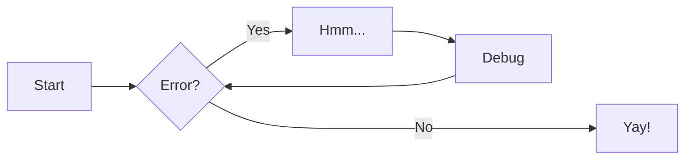

# Welcome to MkDocs

For full documentation visit [mkdocs.org](https://www.mkdocs.org).

Material for MkDocs
- [Plugins](https://squidfunk.github.io/mkdocs-material/plugins/)
- [Setup](https://squidfunk.github.io/mkdocs-material/setup/changing-the-fonts/)


## Commands

- Prerequisite:
    - Python environment
    - `pip install mkdocs`
- Create a new project: `mkdocs new [dir-name]`
- Live-serve application: `mkdocs serve --config-file mkdocs.yml`: 
    ```bash
    # Ports configured in mkdocs.yml
    mkdocs serve --config-file mkdocs.yml

    # Ports configured with CLI options
    mkdocs serve -a 0.0.0.0:8000 --config-file mkdocs.yml
    ```
- Build: `mkdocs build --site-dir site`
- Help: `mkdocs -h`

## Project layout

```rust
mkdocs.yml    # The configuration file.
docs/
    index.md  # The documentation homepage.
    ...       # Other markdown pages, images and other files.
```

## Adding Pages

- To add a new page to our documentaions:
    1. Create a page `*.md` file within docs folder
    2. Add reference to the above file in `mkdocs.yml`

    ```yml
    <!-- mkdocs.yml -->
    nav:
        - git/index.md
        - OS:
            - os/linux.md
            - os/disk.md
    ```

## MkDocs Features

- Quick overview on how to use some features with examples. Find full list [here](https://squidfunk.github.io/mkdocs-material/reference/)

### [Admonitions](https://squidfunk.github.io/mkdocs-material/reference/admonitions/)

- Common Types: `note`, `info`, `success`, `warning`, `danger`
- `!!!`(regular), `???`(expandable)

<pre>
<!-- Example -->
!!! note "Title"

    Body...
</pre>

### [Annotations](https://squidfunk.github.io/mkdocs-material/reference/annotations/)

<pre>
<!-- Example -->
Lorem ipsum dolor sit amet, (1) consectetur adipiscing elit.
{ .annotate }

1.  Annotation content
</pre>

### [Code blocks](https://squidfunk.github.io/mkdocs-material/reference/code-blocks/)

- `hl_lines`: To highlight lines
- [Highlight](https://highlightjs.org/demo#lang=dockerfile&v=1&theme=atom-one-dark&code=RlJPTSB0ZXN0CkNPUFkgYXNkYXMgc2Fkc2EKCg%3D%3D) provides highlight support

<pre>
<!-- Example -->
```py title="bubble_sort.py" hl_lines="2 3-5"
# (1)!
def bubble_sort(items):
    for i in range(len(items)):
        for j in range(len(items) - 1 - i):
            if items[j] > items[j + 1]:
                items[j], items[j + 1] = items[j + 1], items[j]
```

1. Code block with annotations
</pre>

### [Content tabs](https://squidfunk.github.io/mkdocs-material/reference/content-tabs/)

<pre>
<!-- Example -->
=== "Tab1"

    Tab-1 content

=== "Tab2"

    Tab-2 content
</pre>

### [Diagrams](https://squidfunk.github.io/mkdocs-material/reference/diagrams/)

- [Mermaid](https://mermaid.js.org/syntax/gitgraph.html#left-to-right-default-lr) provides diagram support.
- mermaid supports multiple types.

<pre>
<!-- Example -->

</pre>

### [Image]

```markdown
<!-- Example -->
<figure markdown="span">
    
    <figcaption>Example Caption</figcaption>
</figure>
```
