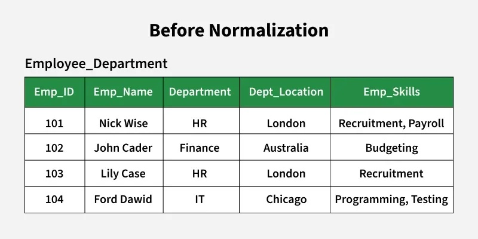

# __:simple-postgresql: SQL__

## What is a DATABASE?

A database is a complete collection of data that includes: Tables, Schemas (in some databases), Views, Indexes, Stored Procedures, Functions, Triggers

__Key Points__:

- Stores all data and database objects.
- Can contain multiple schemas (in PostgreSQL, Oracle).
- In MySQL, "database" and "schema" mean the same thing.
- Each database has its own storage, users, and privileges.

``` .sql
CREATE DATABASE sales_db;
```

---

## What is a SCHEMA?

A schema is a logical collection of database objects like tables, views, indexes, stored procedures, and other structures.

__Key Points__:

- A logical namespace inside a database to organize database objects.
- Helps separate different parts of an application (e.g., hr, sales, inventory).
- Can contain multiple tables.
- Mostly used in PostgreSQL (not MySQL by default).

``` .sql
CREATE SCHEMA hr;
CREATE TABLE hr.employees (
    id SERIAL PRIMARY KEY,
    name VARCHAR(50),
    department VARCHAR(50)
);
```

---

## What is a TABLE?

A table is a structured collection of data stored in rows and columns.

__Key Points__:

- A table exists inside a schema.
- Holds actual data (rows).
- Defined with columns, data types, and constraints.

``` .sql
CREATE TABLE employees (
    id INT PRIMARY KEY AUTO_INCREMENT,
    name VARCHAR(50),
    department VARCHAR(50)
);
```

---

## Data Types


=== "MySQL"

    | Data Type | Description | Example |
    |-----------|------------|---------|
    | `INT` | Integer type (4 bytes). Ranges from `-2,147,483,648` to `2,147,483,647`. | `age INT NOT NULL;` |
    | `BIGINT` | Large integer (8 bytes). Used for very large numbers. | `id BIGINT AUTO_INCREMENT;` |
    | `DECIMAL(p, s)` | Fixed-point decimal (precision `p`, scale `s`). Good for financial data. | `price DECIMAL(10,2);` |
    | `FLOAT` | Floating-point number (4 bytes). Less precise than `DECIMAL`. | `temperature FLOAT;` |
    | `DOUBLE` | Double-precision floating-point (8 bytes). More accurate than `FLOAT`. | `score DOUBLE;` |
    | `CHAR(n)` | Fixed-length string (`n` characters). Padded with spaces. | `code CHAR(3) DEFAULT 'USA';` |
    | `VARCHAR(n)` | Variable-length string (`n` characters). Saves space. | `username VARCHAR(50);` |
    | `TEXT` | Large text storage (up to 4GB). | `description TEXT;` |
    | `DATE` | Stores a date (`YYYY-MM-DD`). | `dob DATE;` |
    | `DATETIME` | Stores date & time (`YYYY-MM-DD HH:MM:SS`). | `created_at DATETIME;` |
    | `TIMESTAMP` | Stores date & time, auto-updates with timezone support. | `updated_at TIMESTAMP DEFAULT CURRENT_TIMESTAMP;` |
    | `BOOLEAN` | Stores `TRUE` or `FALSE` (internally as `TINYINT(1)`). | `is_active BOOLEAN;` |
    | `BLOB` | Binary large object (for images, files, etc.). | `profile_pic BLOB;` |

=== "PostgreSQL"

    | Data Type | Description | Example |
    |-----------|------------|---------|
    | `SERIAL` | Auto-incrementing integer (`INT` + sequence). | `id SERIAL PRIMARY KEY;` |
    | `BIGSERIAL` | Auto-incrementing large integer (`BIGINT` + sequence). | `id BIGSERIAL;` |
    | `INTEGER` / `INT` | Standard integer (4 bytes). | `age INTEGER;` |
    | `NUMERIC(p, s)` | Fixed-point number (like `DECIMAL` in MySQL). | `price NUMERIC(10,2);` |
    | `REAL` | Floating-point number (4 bytes). | `temperature REAL;` |
    | `DOUBLE PRECISION` | High-precision floating point (8 bytes). | `score DOUBLE PRECISION;` |
    | `CHAR(n)` | Fixed-length character string. | `code CHAR(3) DEFAULT 'USA';` |
    | `VARCHAR(n)` | Variable-length string. | `username VARCHAR(50);` |
    | `TEXT` | Unlimited text storage. | `description TEXT;` |
    | `DATE` | Stores a date (`YYYY-MM-DD`). | `dob DATE;` |
    | `TIMESTAMP` | Stores date & time (`YYYY-MM-DD HH:MM:SS`). | `updated_at TIMESTAMP DEFAULT CURRENT_TIMESTAMP;` |
    | `BOOLEAN` | Stores `TRUE` or `FALSE`. | `is_active BOOLEAN DEFAULT TRUE;` |
    | `BYTEA` | Binary data type (like `BLOB` in MySQL). | `file BYTEA;` |
    | `JSON` / `JSONB` | Stores JSON data (`JSONB` is optimized for indexing). | `metadata JSONB;` |

---

## __MySQL v/s PostgreSQL__
| Feature | MySQL | PostgreSQL |
|---------|-------|------------|
| __Auto-Increment__ | `AUTO_INCREMENT` | `SERIAL` / `BIGSERIAL` |
| __Decimal Type__ | `DECIMAL(p, s)` | `NUMERIC(p, s)` |
| __Boolean Type__ | `TINYINT(1)` (internally) | `BOOLEAN` (native support) |
| __Binary Data__ | `BLOB` | `BYTEA` |
| __JSON Support__ | Limited (`JSON` but no indexing) | `JSONB` (Indexable) |

---

## Database Normalization

Database normalization is the process of structuring a relational database to __minimize redundancy__,  __enhance data integrity__, and __improve database efficiency__.

### Why it's required?

<figure markdown="span">
    { width="600" }
    <figcaption>Before Normalization</figcaption>
</figure>

??? warning 

    - __Insertion Anomaly__: If a new department is created but no employee is assigned to it yet, we cannot store its location because we need an employee record to insert
    - __Update Anomaly__: If the location of the HR department changes, we must update it in multiple rows (for both Nick Wise and Lily Case). If one row is missed, the data becomes inconsistent.
    - __Deletion Anomaly__: If all employees in the IT department leave, we lose the department information, including its location.

- __Consistency and Accuracy__: Without normalization, the same data may be stored in multiple places, leading to inconsistencies and errors. Normalization ensures that updates to data are reflected everywhere, maintaining accuracy is one of the primary benefits of database normalization.
- __Efficient Data Management__: Normalized databases are easier to maintain and modify. Changes to the database structure or data can be made with minimal risk of introducing errors.
- __Scalability__: As databases grow, normalized structures make it easier to scale and adapt to new requirements without major redesigns.
- __Data Integrity Enforcement__: By defining clear relationships and constraints, normalization helps enforce business rules and data integrity automatically.
- __Reduced Storage Costs__: Eliminating redundant data reduces the amount of storage required, which can be significant in large databases.


### Features of Normalization

- __Atomicity__: Data is broken down into the smallest meaningful units, ensuring that each field contains only one value (no repeating groups or arrays).
- __Logical Table Structure__: Data is organized into logical tables based on relationships and dependencies, making the database easier to understand and manage.
- __Use of Keys__: Primary keys, foreign keys, and candidate keys are used to uniquely identify records and establish relationships between tables.
- __Hierarchical Normal Forms__: The process follows a hierarchy of normal forms (__1NF__, __2NF__, __3NF__, __BCNF__, etc.), each with stricter requirements to further reduce redundancy and dependency.
- __Referential Integrity__: Relationships between tables are maintained through foreign key constraints, ensuring that related data remains consistent.
- __Flexibility and Extensibility__: Normalized databases can be easily extended or modified to accommodate new data types or relationships without major restructuring.

<!-- __Normalization Forms (1NF - 3NF)__: Normalization is applied in __stages__, called __normal forms (NF)__. -->

=== "__1NF: First Normal Form__"

    __Requirements:__

    - All columns contain atomic values (no lists, sets, or composite fields).
    - No repeating groups. i.e. each field contains only atomic values(single values per field).
    - Each column contains values of a single data type.

    === "Example (Before 1NF)"
        | Customer_ID | Customer_Name | Products      |
        |-------------|---------------|---------------|
        | 1           | John Doe      | Laptop, Mouse |
        | 2           | Jane Smith    | Phone         |
        
    === "Example (After 1NF)"

        | Customer_ID | Customer_Name | Product |
        |-------------|---------------|---------|
        | 1           | John Doe      | Laptop  |
        | 1           | John Doe      | Mouse   |
        | 2           | Jane Smith    | Phone   |

=== "__2NF: Second Normal Form__"

    __Requirements:__

    - Every non-primary key attribute is fully functionally dependent on the entire primary key.
    - Eliminate partial dependencies: __every column must depend on the whole primary key and not part of a composite key.__.

    === "Example (Before 2NF)"

        `Customer_Name` depends only on `Customer_ID`, not the full primary key (`Order_ID`, `Customer_ID`). This is a partial dependency.

        | Order_ID | Customer_ID | Customer_Name | Product  |
        |----------|-------------|---------------|----------|
        | 1        | 101         | John Doe      | Laptop   |
        | 2        | 101         | John Doe      | Mouse    |
        | 3        | 102         | Jane Smith    | Phone    |

    === "Example (After 2NF)"

        __Customers Table__

        | Customer_ID | Customer_Name |
        |-------------|---------------|
        | 101         | John Doe      |
        | 102         | Jane Smith    |

        __Orders Table__

        | Order_ID | Customer_ID | Product  |
        |----------|-------------|----------|
        | 1        | 101         | Laptop   |
        | 2        | 101         | Mouse    |
        | 3        | 102         | Phone    |

=== "__3NF: Third Normal Form__"

    __Requirements:__ 
    
    - Remove __transitive dependencies__ (columns should only depend on the primary key, not on other non-key attributes).

    === "Example (Before 3NF)"

        `Supplier` depends on `Product`, not directly on the primary key.

        | Order_ID | Customer_ID | Product  | Supplier |
        |----------|-------------|----------|----------|
        | 1        | 101         | Laptop   | HP       |
        | 2        | 101         | Mouse    | Logitech |
        | 3        | 102         | Phone    | Apple    |

    === "Example (After 3NF)"

        __Orders Table__

        | Order_ID | Customer_ID | Product_ID |
        |----------|-------------|------------|
        | 1        | 101         | 301        |
        | 2        | 101         | 302        |
        | 3        | 102         | 303        |

        __Products Table__

        | Product_ID | Product_Name  | Supplier_ID |
        |------------|---------------|-------------|
        | 301        | Laptop        | 401         |
        | 302        | Mouse         | 402         |
        | 303        | Phone         | 403         |

        __Suppliers Table__

        | Supplier_ID | Supplier_Name |
        |-------------|---------------|
        | 401         | HP            |
        | 402         | Logitech      |
        | 403         | Apple         |


!!! info "__Final Thoughts__"

    - __1NF:__ Remove duplicates, ensure atomicity.  
    - __2NF:__ Remove partial dependencies (split dependent data into separate tables).  
    - __3NF:__ Remove transitive dependencies (separate unrelated fields). 

---

## Joins

In SQL, `JOIN` is used to combine rows from two or more tables based on a related column. There are several types of joins:

Tables

| id | name    | dept_id |
|----|---------|---------|
| 1  | Alice   | 10      |
| 2  | Bob     | 20      |
| 3  | Charlie | 40      |

| id  | dept_name |
|-----|----------|
| 10  | HR       |
| 20  | IT       |
| 30  | Finance  |


=== "INNER JOIN"

    Returns rows where __there is a match__ in both tables.

    ```sql title="SQL Query"
    SELECT employees.id, employees.name, departments.dept_name
    FROM employees
    INNER JOIN departments ON employees.dept_id = departments.id;
    ```

    | id | name  | dept_name |
    |----|-------|----------|
    | 1  | Alice | HR       |
    | 2  | Bob   | IT       |
        
    __Result__: Only employees __with matching department IDs__ appear.


=== "LEFT JOIN (OUTER JOIN)"

    Returns __all rows from the left table__ and __matching rows from the right table__. If no match, NULL is returned.

    ```sql title="SQL Query"
    SELECT employees.id, employees.name, departments.dept_name
    FROM employees
    LEFT JOIN departments ON employees.dept_id = departments.id;
    ```

    | id | name  | dept_name |
    |----|-------|----------|
    | 1  | Alice | HR       |
    | 2  | Bob   | IT       |
    | 3  | Charlie | NULL    |

    __Use Case:__ Retrieve all employees, even if they __don’t belong to any department__.

=== "RIGHT JOIN"

    Returns __all rows from the right table__ and __matching rows from the left table__.

    ```sql title="SQL Query"
    SELECT employees.id, employees.name, departments.dept_name
    FROM employees
    RIGHT JOIN departments ON employees.dept_id = departments.id;
    ```

    | id  | name  | dept_name |
    |-----|-------|----------|
    | 1   | Alice | HR       |
    | 2   | Bob   | IT       |
    | NULL | NULL  | Finance  |
    
    __Use Case:__ Retrieve all departments, even if they __don’t have employees assigned__.


=== "FULL OUTER JOIN"

    Returns __all rows from both tables__, with `NULL` in unmatched columns.

    ```sql title="SQL Query"
    SELECT employees.id, employees.name, departments.dept_name
    FROM employees
    FULL OUTER JOIN departments ON employees.dept_id = departments.id;
    ```

    | id  | name  | dept_name |
    |-----|-------|----------|
    | 1   | Alice | HR       |
    | 2   | Bob   | IT       |
    | 3   | Charlie | NULL   |
    | NULL | NULL  | Finance |
    
    __Use Case:__ Show all employees __and__ all departments, even those __without matches__.

=== "CROSS JOIN"

    Returns __every combination__ of rows from both tables (__Cartesian product__).

    ```sql title="SQL Query"
    SELECT employees.name, departments.dept_name
    FROM employees
    CROSS JOIN departments;
    ```

    | name   | dept_name |
    |--------|----------|
    | Alice  | HR       |
    | Alice  | IT       |
    | Alice  | Finance  |
    | Bob    | HR       |
    | Bob    | IT       |
    | Bob    | Finance  |
    | Charlie | HR      |
    | Charlie | IT      |
    | Charlie | Finance |
    
    __Use Case:__ Pair __every employee__ with __every department__.

!!! note "__Choosing the Right JOIN__"

    - __INNER JOIN__: Only matching rows
    - __LEFT JOIN__: All left rows, matched right rows
    - __RIGHT JOIN__: All right rows, matched left rows
    - __FULL OUTER JOIN__: All rows from both tables
    - __CROSS JOIN__: Every combination (Cartesian product)

---

## Locks

- Locks are used to ensure data integrity and transaction isolation during concurrent access.
- Most modern relational databases automatically acquire and release locks during:
    - `SELECT`, `INSERT`, `UPDATE`, `DELETE` operations.
    - When you start and end transactions.
    - Depending on your isolation level.
- Types of locks:

    | Lock Type        | Use Case                       | Concurrency | Safety      |
    | ---------------- | ------------------------------ | ----------- | ----------- |
    | Row-level        | OLTP systems, high concurrency | High        | High        |
    | Table-level      | Simple queries, bulk ops       | Low         | Medium      |
    | Shared Lock      | Read-only operations           | High        | Medium      |
    | Exclusive Lock   | Updates, deletes               | Low         | High        |
    | Optimistic Lock  | Web APIs, disconnected apps    | High        | App-managed |
    | Pessimistic Lock | High-contention systems        | Low         | DB-managed  |


---

## Isolation

| id | name | balance |
| --- | --- | --- |
| 1 | Alice | 1000 |
| 2 | Bob | 1000 |

=== "`READ UNCOMMITTED`"

    - Allows dirty reads: you can read uncommitted changes from another transaction.
    - Very fast, very dangerous.

    ```sql title="Dirty Read"
    -- Transaction A
    BEGIN;
    UPDATE accounts SET balance = balance - 100 WHERE id = 1;
    -- Not committed yet

    -- Transaction B
    SET TRANSACTION ISOLATION LEVEL READ UNCOMMITTED;
    BEGIN;
    SELECT * FROM accounts WHERE id = 1;
    -- Sees balance = 900 (uncommitted!)

    -- Transaction A
    ROLLBACK;
    ```

=== "`READ COMMITTED`"

    - Only reads committed data.
    - Prevents dirty reads.
    - Allows non-repeatable reads and phantom reads.

    ```sql title="Non-repeatable reads"
    -- Transaction A
    BEGIN;
    UPDATE accounts SET balance = balance - 100 WHERE id = 1;
    -- Not committed yet

    -- Transaction B
    SET TRANSACTION ISOLATION LEVEL READ COMMITTED;
    BEGIN;
    SELECT balance FROM accounts WHERE id = 1;
    -- Sees 1000, not 900 (dirty read prevented)

    -- Transaction A
    COMMIT;

    -- Transaction B
    SELECT balance FROM accounts WHERE id = 1;
    -- Now sees 900 → non-repeatable read
    ```

=== "`REPEATABLE READ`"

    - Prevents dirty and non-repeatable reads.
    - Allows phantom reads (new rows may appear).

    ```sql title="Phantom reads"
    -- Transaction A
    SET TRANSACTION ISOLATION LEVEL REPEATABLE READ;
    BEGIN;
    SELECT balance FROM accounts WHERE id = 1;
    -- Sees 1000

    -- Transaction B
    BEGIN;
    UPDATE accounts SET balance = 500 WHERE id = 1;
    COMMIT;

    -- Transaction A
    SELECT balance FROM accounts WHERE id = 1;
    -- Still sees 1000 (repeatable read holds)

    -- Transaction B
    INSERT INTO accounts VALUES (3, 'Charlie', 700);

    -- Transaction A
    SELECT * FROM accounts WHERE balance > 600;
    -- Sees Charlie
    ```

=== "`SERIALIZABLE`"

    - Most strict.
    - Transactions behave as if they were executed one by one.
    - Prevents dirty reads, non-repeatable reads, and phantom reads.

    ```sql
    -- Transaction A
    SET TRANSACTION ISOLATION LEVEL SERIALIZABLE;
    BEGIN;
    SELECT COUNT(*) FROM accounts WHERE balance > 600;
    -- Let's say result = 2

    -- Transaction B
    BEGIN;
    INSERT INTO accounts VALUES (3, 'Charlie', 700);
    -- PostgreSQL will block here or fail with serialization error
    COMMIT;

    -- Transaction A
    SELECT COUNT(*) FROM accounts WHERE balance > 600;
    -- Still sees 2 (phantoms prevented)
    ```

### Read Anomalies

| Problem | Involves | Description |
| --- | --- | --- |
| __Dirty Read__ | Read-Read  | A reads uncommitted write from B |
| __Non-repeatable Read__ | Read-Write | A reads, B updates, A reads again → values differ |
| __Phantom Read__ | Read-Write | A reads rows matching a condition, B inserts new rows matching that condition before A re-reads |

### Write Anomalies

=== "Dirty Write"

    - Transaction B writes to a row that was modified but not yet committed by A.
    - Allowed in: `READ UNCOMMITTED`.
    - PreventED by: `READ COMMITTED` and above.

    ```sql
    -- T1
    BEGIN;
    UPDATE accounts SET balance = 900 WHERE id = 1;

    -- T2 (before T1 commits)
    BEGIN;
    UPDATE accounts SET balance = 800 WHERE id = 1;
    -- ❌ overwrites uncommitted write
    ```

=== "Lost Update"

    - A and B both read the same value and update it — one update is lost.
    - Allowed in: `READ COMMITTED`, `REPEATABLE READ`.
    - Prevented by: `SERIALIZABLE` or Optimistic Locking.

    ```sql
    -- T1
    BEGIN;
    SELECT balance FROM accounts WHERE id = 1; -- sees balance = 1000
    UPDATE accounts SET balance = balance - 100 WHERE id = 1;
    COMMIT;

    -- T2 (concurrently)
    BEGIN;
    SELECT balance FROM accounts WHERE id = 1; -- also sees balance = 1000
    UPDATE accounts SET balance = balance - 200 WHERE id = 1;
    COMMIT;
    -- ❌ T1's update is lost
    ```

=== "Write Skew"

    - A and B make writes based on reads, which independently are valid but together violate constraints (common in constraint-sensitive domains like scheduling, accounting, etc.)
    - Allowed in: `READ COMMITTED`, `REPEATABLE READ`.
    - Prevented by: `SERIALIZABLE` (or application logic with locking).

    ```sql
    -- Doctor A and B both on call

    -- T1:
    BEGIN;
    SELECT * FROM doctors WHERE on_call = true;
    -- sees A & B
    UPDATE doctors SET on_call = false WHERE name = 'A';

    -- T2:
    BEGIN;
    SELECT * FROM doctors WHERE on_call = true;
    -- also sees A & B
    UPDATE doctors SET on_call = false WHERE name = 'B';

    -- Both commit: ❌ no doctor on call
    ```
