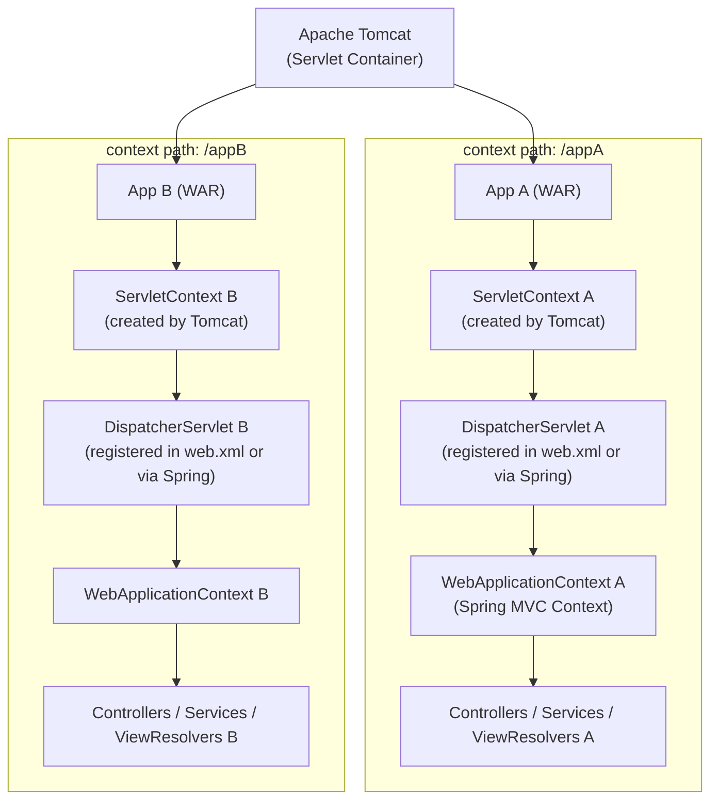

# __:simple-springboot: Spring Boot__

__Documentation__: https://docs.spring.io/spring-boot/index.html

Spring Boot is an open-source Java framework designed to simplify the development of stand-alone, production-ready applications. It provides a __convention-over-configuration__ approach, eliminating the need for extensive setup. Spring Boot uses Spring behind the scences

__Key Features__:

- __Auto-configuration__: Automatically configures Spring applications based on dependencies.
- __Embedded Servers__: Includes Tomcat, Jetty, and Undertow for easy deployment.
- __Spring Boot Starters__: Pre-configured dependency bundles for quick setup.
- __Production-Ready__: Built-in monitoring, health checks, and externalized configuration.
- __Microservices Support__: Designed to work seamlessly with cloud-based architectures.


``` .pgsql title="Typical Project Structure"
my-app/
├── build.gradle
├── settings.gradle
├── gradlew
├── gradlew.bat
├── gradle/
│   └── wrapper/
├── src/
│   ├── main/
│   │   ├── java/com/example/
│   │   │   └── App.java
│   │   ├── resources/
│   │       └── application.properties
│   ├── test/
│       ├── java/com/example/
│       │   └── AppTest.java
│       ├── resources/
│
└── .gitignore
```

- __Spring Initializer__: Helps Bootstrap a Spring Boot application. [click here](https://start.spring.io)
- __Spring Projects__: Additional Spring modules built-on top of the core Spring Framework. e.g. Spring Cloud, Spring Data, Spring Security. [full list](https://spring.io/projects)
- __Spring Boot Starters__: A curated list of maven dependencies. 
    - Tested and verified by the spring Development Team.
    - Makes it much easier to get started with Spring.
    - reduces the amount of configuration required.
    - e.g. `spring-boot-starter-web`, `spring-boot-starter-security`, `spring-boot-starter-data-jpa`. [full list](https://docs.spring.io/spring-boot/reference/using/build-systems.html#using.build-systems.starters)
    <figure markdown="span">
        { width="50%" }
        <figcaption>Spring Boot Starters</figcaption>
    </figure>
- __Spring Boot Starter Parent__: It is a specialized parent POM that provides default configurations when using Maven. And, it simplifies dependency management by:
    - Defining default versions for Spring Boot and related dependencies.
    - Providing common build configurations(e.g. compiler settings, resource filtering)
- __Spring Boot BOM__: In gradle setup, dependencies are managed using BOM(Bill of Materials). [Full details](../../automation/build/gradle.md#spring-boot-bom)
- __Spring Boot Dev Tools__: Automatically restarts your application when code is updated


## Spring Architecture

<figure markdown="span">
  
  <figcaption>Spring MVC Architecture</figcaption>
</figure>



??? note "Servlet/Web Container"

    - A part of a Java EE server (e.g., Apache Tomcat, Jetty, GlassFish) that provides the runtime environment for Servlets.
    - Tomcat creates a separate classloader and ServletContext for each deployed WAR to ensure isolation.
    - Loads, manages, and executes servlets.
    - Handles HTTP requests and responses.
    - Provides:
        - Multithreading
        - Servlet Lifecycle management (init, service, destroy)
        - Session and cookie management: Manages HTTP sessions, cookies, and tracking
        - Access to the ServletContext and HttpServletRequest
        - Security & Config: Handles authentication, SSL, and web.xml-based config


??? note "Servlet"

    - A Java class that handles HTTP requests (like a controller) and generates responses (usually HTML, JSON, etc.).
    - Lifecycle:
        - `init()`: Called __once__ when the servlet is first created
        - `service()`: Called for __each request__, dispatches to `doGet()`, `doPost()`, etc.
        - `destroy()`: Called once when the servlet is removed (e.g., server shutdown)
    - Spring MVC builds on top of the Servlet API. But, most of the servlets are abstracted by Spring.

    __Types__:

    === "`DispatcherServlet`"

        - The Front Controller
        - Central servlet that intercepts all incoming HTTP requests.
        - Delegates request handling to appropriate controllers, view resolvers, and handlers.
        - Configured in 2 ways:
            - `web.xml`(legacy, XML-based setup)
            - `WebApplicationInitializer` / `SpringBootServletInitializer` in Spring Boot

    === "`HttpServlet`"

        - `DispatcherServlet` is a subclass of `HttpServlet`.
        - It handles: `doGet`, `doPost`, `doPut`, `doDelete` under the hood.

    === "`FrameworkServlet`"

        - `DispatcherServlet` extends `FrameworkServlet`, which handles: 
            - Application context setup
            - Locale resolution
            - Multipart (file upload) support

    === "Other Filters (Servlet-Based)"

        Spring Boot auto-configures these as servlet filters:

        - `SpringSecurityFilterChain` (if using Spring Security)
        - `CorsFilter` (for CORS handling)
        - `RequestContextFilter`

        These are not servlets, but filters, meaning they run before the DispatcherServlet.


??? note "Contexts"

    === "`ServletContext`"

        - Provided by the Servlet container (like Tomcat or Jetty).
        - Each deployed app has its own ServletContext.
        - Represents the web apps global configuration and resources.
        - Shared across all servlets and filters.
        - Part of Servlet API, not Spring-specific.
        - Responsibilities:
            - Storing app-wide parameters (setAttribute)
            - Accessing resources (getResource)
            - Logging (log)
            - Getting servlet context path, real path, etc.

    === "ApplicationContext"

        - Each DispatcherServlet initializes its own WebApplicationContext, which is a Spring container.
        - The ApplicationContext is the central interface to the Spring IoC container.
        - Variants:
            - `AnnotationConfigApplicationContext` (for Java-based config)
            - `WebApplicationContext` (specialized for web apps. Wire web-related beans like controllers and services.)
            - `ClassPathXmlApplicationContext` (for XML config)
        - Responsibilities:
            - Creating and managing beans (i.e., dependency injection)
            - Handling configuration (from XML, Java annotations, or properties)
            - Managing the lifecycle of application components
            - Providing features like internationalization, event publishing, and more


## Actuator

Spring Boot actuator provides DevOps functionalities to monitor and manage your application. This can be enabled by adding `spring-boot-starter-actuator` dependency to your project. This exposes several endpoints for metrics. 

Here are some common endpoints:

- `/health`: Health information about your application
- `/auditevents`: Audit events for your application
- `/beans`: List of all beans registed in the Spring application context
- `/mappings`: List of all `@RequestMapping` paths
- Full list of endpoints can be found [here](https://docs.spring.io/spring-boot/reference/actuator/endpoints.html).

__Configuring Endpoints__:

- All endpoints are prefixed with `/actuator`.
- By default only `/health` is enabled.

``` .properties title="Configuring Actuator endpoints"
# Overrides default /actuator endpoint
management.endpoints.web.base-path=/manage

# To enable specific endpoints
management.endpoints.web.exposure.include=health,info,beans,mappings

# Exposes environment properties (like system properties and environment variables) in addition to other information
management.info.env.enabled=true

# To expose all endpoints
management.endpoints.web.exposure.include=*

# To exclude certain endpoints.
# Typically used in tandem with management.endpoints.web.exposure.include
management.endpoints.web.exposure.exclude=health,info

# Specify the application metadata to be exposed by /info
info.app.name = Test
info.app.description = Testing application
info.app.version = 0.0.1-SNAPSHOT
```

- These endpoints can also be secured. [details](https://docs.spring.io/spring-boot/reference/actuator/endpoints.html#actuator.endpoints.security)

## Spring Container

- Leverages __Inversion of Control__ to create and manage objects.
- ==Objects managed by Spring container are called Beans.==
- Inject object dependencies through Dependency Injection.
- Spring makes use of Autowiring for dependency injection. Spring will look for a class that matches by type(class or interface), and inject it automatically.
- Three ways to configure Spring Container:
    - XML configuration file(legacy)
    - Java Annotations (modern).
    - Java Source Code (modern).

Spring Scans for special annotations like `@Component`, `@Service`, `@Controller` to register corresponding beans for dependency injection. By default, Spring Boot starts component scanning from the same package as your main Spring Boot application. Also scans sub-packages recursively. To explicitly configure the packages to scan:

``` .java
@SpringBootApplication(
		scanBasePackages = {
				"io.dev.env.spring_tutorials", "io.dev.env.utils"  // If you want to scan more packages
		}
)
```

### Annotaion based injection types

``` .java title="Bean Class" hl_lines="1"
@Component("myCustomBeanId")
public class CricketCoach {
    ...
}
```

=== "Constructor Injection"

    Use this when you have required dependencies

    ``` .java
    @RestController
    public class DemoController {
        private CricketCoach cricketCoach;
        
        @Autowired
        public DemoController(CricketCoach cricketCoach) {
            this.cricketCoach = cricketCoach;
        }
    }
    ```

=== "Setter Injection"

    Use this when you have optional dependencies

    ``` .java hl_lines="5"
    @RestController
    public class DemoController {
        private CricketCoach cricketCoach;
        
        // We can give any method name, dosen't have to be a setter method, though recommended.
        @Autowired
        public void setCoach(CricketCoach cricketCoach) {
            this.cricketCoach = cricketCoach;
        }
    }
    ```

=== "Field Injection"

    Accomplished using Java reflections

    ``` .java
    @RestController
    public class DemoController {
        @Autowired
        private CricketCoach cricketCoach;
    }
    ```

!!! warning

    Constructor, and Setter injection is the recommended approach. As this makes it easier to create mocks for unit tests. {--Do not use field injection--}

### Injection with Multiple Implementaions

When we have multiple implementations of an interface, Spring would throw an error when trying to inject an instance of the interface. This because spring can't decide which implmentation to inject. 

=== "Qualifiers"

    We can use `@Qualifier` to explicitly specify the implementation to inject

    ``` .java
    public interface Coach {
        ...
    }

    @Component
    public class CricketCoach implements Coach {
        ...
    }

    @Component
    public class BaseballCoach implements Coach {
        ...
    }

    @RestController
    public class DemoController {
        private Coach coach;

        // The bean Id here is the implementation class name in camel case
        // 1. Constructor Injection
        @Autowired
        public DemoController(@Qualifier("cricketCoach") Coach coach) {
            this.coach = coach;
        }

        // 2. Setter Injection
        @Autowired
        public void setCoach(@Qualifier("baseballCoach") Coach coach) {
            this.coach = coach
        }
    }
    ```

=== "Primary"

    We can use `@Primary` to specify the default implementation to inject, unless a `@Qualifier` is provided.

    ``` .java
    @Component
    @Primary    // Tells Spring to use this implementaion by default for injection
    public class CricketCoach implements Coach {
        ...
    }
    ```

### Lazy Initialization

By default all beans are created and loaded to Spring container during application startup process. Instead we can specify Lazy initialization. And the bean will only be initialized in the following cases:

- It's needed for dependency injection.
- Or it is explicitly requested.

``` .java
@Component
@Lazy
public class CricketCoach implements Coach {
    ...
}
```

To set Lazy initialization as default:

``` properties
// This includes lazy initialization of controllers
spring.main.lazy-initialization=true
```

### Bean Scopes

Scope refers to how many instances are created and how they are shared.

| Scope | Description |
| --- | --- |
| singleton | One instance per Spring container (default) |
| prototype | New instance per request to getBean() |
| request | One instance per HTTP request |
| session | One instance per HTTP session |
| application | One instance per ServletContext (web app) |
| websocket | One instance per WebSocket session |

``` .java title="Singleton or Prototype scopes"
import org.springframework.beans.factory.config.ConfigurableBeanFactory;

@Component
@Scope(ConfigurableBeanFactory.SCOPE_PROTOTYPE)
// ConfigurableBeanFactory.SCOPE_SINGLETON
public class CricketCoach implements Coach { }
```

``` .java title="Request, Session, Application, WebSocket scopes"
import org.springframework.web.context.WebApplicationContext;

@Component
@Scope(WebApplicationContext.SCOPE_REQUEST)
// WebApplicationContext.SCOPE_SESSION, WebApplicationContext.SCOPE_APPLICATION, WebApplicationContext.SCOPE_WEBSOCKET
public class CricketCoach implements Coach { }
```

### Bean Lifecycle

Allows execution of custom business logic during bean initialization or desctruction. e.g.

- Setting up handles to resources (db. socket, file, etc)
- Clean up handles to resources (db. socket, file, etc)

``` .java
@Component
public class CricketCoach implements Coach {
    // Initialization
    @PostConstruct
    public void init() {
        ...
    }

    // Destroy
    @PreDestroy
    public void destroy() {
        ...
    }
}
```

!!! warning

    ==Spring does not manage the complete lifecycle of a prototype bean==. Although, initialization lifecycle callback methods are called on all objects regardless of scope, in the case of prototypes, configured destruction lifecycle callbacks are not called. The client code must clean up prototype-scoped objects and release expensive resources that the prototype bean(s) are holding.

### Code Based Dependency Injection

This is useful, when you want to use third-party(not editable) class as a Spring bean.

``` .java
@Configuration
public class SportConfig {
    // bean id defaults to method name
    @Bean
    public Coach swimCoach() {
        return new SwimCoach();
    }
}
```

## Layers

Spring Boot follows a layered architecture to separate concerns and improve maintainability. Each layer is responsible for a specific aspect of the application.

- [Controller Layer](./controller.md)
- [Service Layer](./controller.md/#service-layer)
- [Repository Layer](./repository.md)
- [Model Layer](./model.md)
- [Exception Handling Layer](./controller.md/#exception-handling-layer)
- [Security Layer](./security.md)