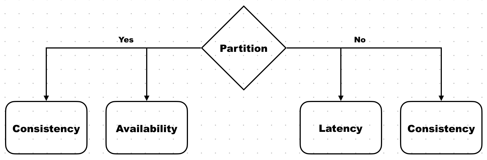
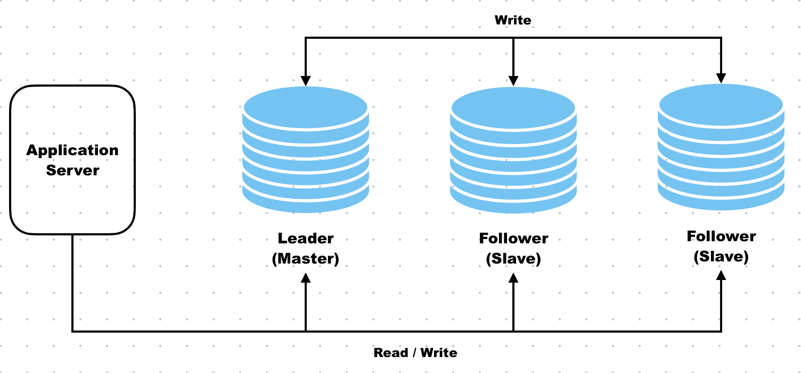

# Concepts

Design considerations for a distributed system:

=== "__Availability__"

    - The system continues to operate and respond to requests even if some components fail.
    - Every request receives a (non-error) response — even if it’s not the most recent data.
    - Focus: System uptime and responsiveness.
    - Example: If one node fails, traffic is rerouted to another.

=== "__Consistency__"

    - All nodes see the same data at the same time.
    - A read after a write always returns the most recent data (assuming no new write occurred).
    - Types: Strong, eventual, causal consistency, etc.
    - Example: In a bank, if you transfer ₹500, your balance should instantly reflect the change across all devices.

=== "__Latency__"

    - The time it takes to process a single request from start to finish.
    - Measured in: Milliseconds (ms), Microseconds (μs)

=== "__Scalability__"

    - The system can handle increasing load by adding more resources.
    - Types:
        - Vertical scaling: More CPU/RAM on one machine.
        - Horizontal scaling: More machines/nodes.
    - Example: A cloud service that can handle millions of users by adding more servers.

=== "__Reliability__"

    - The system performs correctly over time, even with expected failures.
    - The ability to consistently deliver correct results.
    - Built on availability + fault tolerance + durability.
    - Example: A messaging app that never loses messages, even during outages.

=== "__Fault Tolerance__"

    - The system continues to work even when some parts fail.
    - The ability to detect, isolate, and recover from failures without stopping the system.
    - Related to redundancy, replication, and graceful degradation.
    - Example: If one microservice goes down, others still respond, or a fallback is used.

=== "__Throughput__"

    - Number of operations (e.g. requests, transactions) completed per second, minute, etc.
    - Measured in:
        - Requests/second (RPS)
        - MB/s (for data transfer)
        - Transactions/second (TPS)

## PACELC

- If there is a Partition, then choose between Availability and Consistency,
Else, choose between Latency and Consistency.

<figure markdown="span">
    { width="75%" }
</figure>

## Replication

- Involves creating multiple copies of data called replicas on different servers.
- Key Characteristics:
    - Improves availability
    - Lowers latency
    - Improves scaling

### Types

#### Leader-follower replication

<figure markdown="span">
    { width="75%" }
</figure>

- One DB acts as leader, and the rest are followers.
- Write operations are directed to leader, and subsequently propogated to followers.
- Read operations are distributed across all DBs.
- Read capacity > Write capacity

#### Leader-Leader replication

<figure markdown="span">
    { width="75%" }
</figure>

- Multiple leader DBs.
- Write operations are directed to any leader, and subsequently propogated to the other DBs.
- Read operations are distributed across all DBs.
- Read capacity = Write capacity.
- ==However, there maybe conflicts between leader DBs. This requires setting up conflict resolution.==
- ==Conflict Resolution Mechanisms==:
    - __Timestamp-based Resolution__: The update with the most recent timestamp is preferred and overrides others.
    - __Last-write Resolution__: The update with the most recent write, regardless of timestamp is preferred.
    - __Custom Resolution__: Application specific rules, based on nature of data.

#### Synchronous

- Leader and Follower are updated synchronously. i.e. no operations are permitted before previous operation is completely propogated.
- Slower than asynchronous replication. Impacts write performance.
- Guarantees consistency.

#### Asynchronous

- Replications are done asynchronously. i.e. another operations is permitted before previous operations are completely propogated.
- Faster than synchronous replication.
- Temporary data inconsistencies.

## Sharding

<figure markdown="span">
    { width="75%" }
</figure>

- Distributes data across multiple DBs called shards.
- Data is distributed based on sharding key.
- Types of shard keys
    - Range-based: 
    - Hash-based:
- Allows horizontal scaling.
- SQL databases don't offer sharding out-of-the box.
- NoSQL databases have built-in sharding support.

## Estimations

- Estimations are rough calculations performed to determine the capacities required by a system.
- System capabilities are defined using various metrics.
- Common metrics:

=== "__Storage__"

    - __Memory(RAM)__:
        - measured in base 2. i.e. are exact powers of 2. 
        - e.g. KiB(1,024 bytes), MiB, GiB. 
    - __Disk Storage__:
        - measured in base 10. ==Used for ease==.
        - e.g. KB, MB, GB(1,000^3^ bytes), TB.

=== "__Network Bandwidth__"

    - __Bandwidth/Throughput__: 
        - The maximum rate at which data can be transmitted over a network connection.
        - Measured in base 10. ==bits per second(b/s)==.
        - e.g. Kbps(1,000,000 bits), Mbps, Gbps
    - __Data Transfer__:
        - The total amount of data actually sent or received over the network in a given time or session.
        - Measured in base 10. ==bytes per second(B/s)==.
        - e.g. KB/s, MB/s

=== "__CPU & Performance__"

    - "__Clock speed__":
        - Number of cycles per second.
        - Base 10.
        - e.g. GHz(1,000^3^ cycles/sec), MHz
    - "__Instructions/sec__:
        - Number of instructions per second.
        - Base 10
        - e.g. MIPS(Millions of instructions per second)
    - "__Cache size__":
        - CPU cache size.
        - Base 2.
        - e.g. KB, MB(1024^2^ bytes)

=== "__Memory Allocation__"

    - __Heap/Stack sizes__:
        - JVM and OS use binary multiples.
        - Base 2.
        - e.g. MiB, GiB

=== "__Concurrency__"

    - __Requests/sec__:
        - Often used in throughput benchmarking.
        - Base 10.
        - e.g. RPS
    - __Latency__:
        - Time it takes to process a single request.
        - Base 10.
        - e.g. s, ms(10^-3^ sec), µs(10^-6^ sec), ns(10^-9^ sec)

--- 

=== "Average server specification"

    | Component | Count |
    | --- | --- |
    | Processor | Intel Xeon (Sapphire Rapids 8488C) |
    | Number of cores | 64 cores |
    | RAM | 256 GB |
    | Cache (L3) | 112.5 MB |
    | Storage | capacity 16 TB |

=== "Important Latency figures"

    | Component | Time |
    | --- | --- |
    | L1 cache reference | 0.9 ns |
    | L2 cache reference | 2.8 ns |
    | L3 cache reference | 12.9 ns |
    | Main memory reference | 100 |
    | Compress 1KB with Snzip | 3 µs |
    | Read 1 MB sequentially from memory | 9 µs |
    | Read 1 MB sequentially from SSD | 200 µs |
    | Round trip within same datacenter | 500 µs |
    | Read 1 MB sequentially from SSD with speed ~1GB/sec SSD | 1 ms |
    | Disk seek | 4 ms |
    | Read 1 MB sequentially from disk | 2 ms |
    | Send packet SF->NYC | 71 ms |

=== "Important Througput figures"

    | | |
    | --- | --- |
    | QPS handled by MySQL | 1000 |
    | QPS handled by key-value store | 10,000 |
    | QPS handled by cache server | 100,000–1 M |

Types of workloads:

- __CPU-bound__: Primarily depend on the processor of a node. e.g. 3 µs
- __Memory-bound__: Primarily depend on the processor of a node. e.g. 9 µs
- __IO-bound__: Primarily bottlenecked by the IO subsystem
(such as disks or the network). e.g. 200 µs

### Examples

??? "RPS Calculation"

    - To calculate number of requests(program executions) a server can handle in a second.
    - Assumptions:
        - We assume that each instruction can be executed in one clock cycle. i.e. `CPI=1` (clock cycles per instruction).
        - Processor clock speed = 3.5 GHz (3,500,000,000 cycles per second).
        - Processor has 64 cores.
        - On average each request needs 3.5 million instructions.

    $$
    \text{CPU}_{\text{ time per request}} = \text{Instruction}_{\text{ per request}} \times \text{CPI} \times \text{CPU}_{\text{ time per clock cycle}}
    $$

    $$\text{Instruction}_{\text{ per request}} = {3.5 \cdot 10^6}$$

    $$\text{CPI} = 1$$

    $$\text{CPU}_{\text{ time per clock cycle}} = \frac{1}{3.5 \cdot 10^9}$$

    $$
    \text{CPU}_{\text{ time per request}} = (3.5 \cdot 10^6) \times 1 \times \frac{1}{3.5 \cdot 10^9} = 0.001 \text{ seconds}
    $$

    $$\text{Total requests a CPU executes in 1 second} = \frac{1}{0.001} = 1000 \text{ requests}$$

    $$\text{Total requests a 64 core server executes in 1 second} = 64000 \text{ requests}$$

??? "#Servers required"

    - Calculate number of servers required to handle Twitter-like service.
    - Assumptions:
        - 500 million (M) daily active users (DAU).
        - A single user makes 20 requests per day on average.
        - Single server (with 64 cores) can handle 64000 RPS.

    $$\text{Total requests}_{\text{ per day}} = \text{Average requests}_{\text{ per user per day}} \times \text{DAU}$$

    $$\text{Total requests}_{\text{ per day}} = 20 \times (500 \cdot 10^6) = (10 \cdot 10^9)$$

    $$\text{Total requests}_{\text{ per second}} = \frac{10 \cdot 10^9}{24 \times 60 \times 60} = (115 \cdot 10^3)$$

    $$\text{Total servers required} = \frac{\text{Total requests}_{\text{ per second}}}{\text{CPU}_{\text{ request per second}}} = \frac{(115 \cdot 10^3)}{64000} = 2$$

    ??? warning

        - We assumed the daily requests is uniformly distributed throught the day. Thus, the above estimate is a lower bound requirement of the system.
        - Alternatives:

            - Peak capacity: we assume all the requests comes in at the same second.
                
                $$\frac{\text{Number of request/second}}{\text{RPS of server}} = \frac{\text{10 Billion}}{64000} = \text{115 K servers}$$

            - Pareto principle: 80% of peak traffic occurs within 20% of the time.

                $$\frac{\text{Number of request/second}}{\text{RPS of server}} = \frac{\frac{0.80 \times \text{10 Billion}}{0.2 \times 24 \times 60 \times 60}}{64000} = 8 \text{ servers}$$

??? "Storage required"

    - Estimate the storage required by Twiter for new tweets in a year.
    - Assumptions:
        - 500M daily active users.
        - Each user posts 3 tweets per day.
        - 10% of tweets contain images, 5% contain a video. Any containing image won't contain video and vice-versa.
        - Average image is 200 KB, and video is 3 MB in size.
        - Tweet and it's metadata require a total of 250 bytes of storage.

    $$\text{Total tweets}_{\text{ per day}} = (500 \cdot 10^6) \times 3 = \text{1.5 Billion}$$

    $$\text{Storage of tweets}_{\text{ per day}} = 250 \times \text{1.5 Billion} = \text{375 GB}$$

    $$\text{Storage of images}_{\text{ per day}} = (200 \cdot 10^3) \times 0.10 \times \text{1.5 Billion} = \text{30 TB}$$
    
    $$\text{Storage of videos}_{\text{ per day}} = (3 \cdot 10^6) \times 0.05 \times \text{1.5 Billion} = \text{225 TB}$$

    $$\text{Total storage}_{\text{ per day}} = \text{255.375 TB}$$

    $$\text{Total storage}_{\text{ per year}} = 255.375 \times 365 = \text{93.2 PB}$$
    

??? "Bandwidth required"

    - Estimate the bandwidth requirement for Twiter.
    - Assumption:
        - Incoming Data: 500 DAU, 3 tweets/user, tweet(250 bytes/tweet), image(200KB/0.10 tweets), video(3MB/0.05 tweets)
        - Outgoing Data: 500 DAU, 50 tweet views/user, tweet(250 bytes/tweet), image(200KB/0.10 tweets), video(3MB/0.05 tweets)
    - Steps:
        - Estimate daily amount of incoming data to the service.
        - Estimate daily amount of outgoing data from the service.
        - Estimate bandwidth in Gbps by dividing the incoming and outgoing data by number of seconds in a day.

    $$\text{Incoming Bandwidth} = \frac{255 \cdot 10^{12}}{24 \times 60 \times 60} \times \text{8 bits}= \text{24 Gbps}$$

    --- 
    $$\text{Total tweets}_{\text{ per day}} = (500 \cdot 10^6) \times 50 = \text{25 Billion}$$

    $$\text{Tweets viewed}_{\text{ per second}} = \frac{25 \cdot 10^9}{24 \times 60 \times 60} = 289 \cdot 10^3$$

    $$\text{Bandwidth for tweets} = (289 \cdot 10^3) \times 250 \times 8 = \text{0.578 Gbps}$$

    $$\text{Bandwidth for images} = (289 \cdot 10^3) \times 0.1 \times (200 \cdot 10^3) \times 8 = \text{46.24 Gbps}$$

    $$\text{Bandwidth for videos} = (289 \cdot 10^3) \times 0.05 \times (3 \cdot 10^6) \times 8 = \text{346.24 Gbps}$$

    $$\text{Total Outgoing Bandwidth} = 0.578 \times 46.24 \times 347 = \text{394 Gbps}$$

    ---

    $$\text{Total Bandwidth} = \text{Incoming Bandwidth} + \text{Outgoing Bandwidth} = \text{417.62 Gbps}$$

