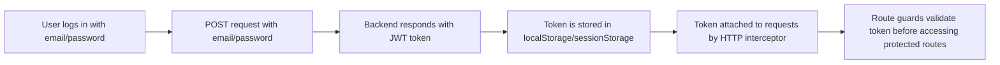

# __:material-angular: Angular__

## Setup

- create new project

```bash
ng new my-project
cd my-project
```

- create new component

```bash
ng generate component my-component
```

- create a new directive

```bash
ng generate directive highlight
```

- create a new service

```bash
ng generate service data
```

## Component

- Component are reusable.
- Naming convention
    - file: `name.component.ts`
    - class name: `NameComponent`
- basic definition includes:
    - selector(required): Can take many forms, tag(`app-example`), attribute(`[app-example]`), class(`.app-example`).
    - template(required): Can be defined as single (template, templateUrl), or multiple(templateUrls).
    - styles(optional): Can be defined as styles([]), styleUrls
    - logic & data: Class with the business logic

```ts title="hello.component.ts"
import { Component } from "@angular/core";

@Component({
  selector: "app-hello",
  // selector: '[appHello]'
  // selector: '.appHello'
  templateUrls: [`./hello.component.html`],
  // template: `<h2>Hello, {{ name }}!</h2>`,
  // templateUrl: `./hello.component.html`,
  styleUrls: ["./hello.component.css"],
  // styles: ['h3 { color: "blue"}'],
})
export class HelloComponent {
  title = "Developer";
  name = "Ron";
  imgUrl = "https://Ron.image.facebook.com";

  handleClick() {
    console.log("Clicked!");
  }
}
```

```html title="other.component.html"
<!-- selector: 'app-hello' -->
<app-hello></app-hello>

<!-- selector: '[appHello]' -->
<div appHello></div>

<!-- selector: '.appHello' -->
<div class="appHello"></div>
```

### Data binding

- Data binding connects your component class (logic) and template (view) so they stay in sync.

```html title="hello.component.html"
<div>
  <!-- Interpolation -->
  <h1>{{ title }}</h1>

  <!-- property binding -->
  

  <!-- Event Binding -->
  <button (click)="handleClick()">Click me</button>

  <!-- Two-way Binding -->
  <!-- any changes made to name in ts file will update input.value and vice-versa -->
  <input [(ngModel)]="name" />
  <p>Hello, {{ name }}</p>
</div>
```

| Type             | Direction            | Syntax                | Use Case                                        |
| ---------------- | -------------------- | --------------------- | ----------------------------------------------- |
| Interpolation    | Component → Template | `{{ value }}`         | Display data                                    |
| Property binding | Component → Template | `[property]="value"`  | Bind DOM property (e.g., `[src]`, `[disabled]`) |
| Event binding    | Template → Component | `(event)="handler"`   | Listen to events like click                     |
| Two-way binding  | Bi-directional       | `[(ngModel)]="value"` | Sync input fields                               |

#### Custom Two-way binding

- Custom two-way binding allows a parent component to bind to a child component’s property and get notified when it changes — using the `[(...)]` syntax.
- For this, Angular looks for:
    - `@Input() value`
    - `@Output() valueChange`
    - Together, these make `[(value)]` valid!

```ts title="counter.component.ts"
@Component({
  selector: 'app-counter',
  template: `
    <button (click)="decrement()">−</button>
    <span>{{ count }}</span>
    <button (click)="increment()">+</button>
  `
})
export class CounterComponent {
    @Input() count: number = 0;
    @Output() countChange = new EventEmitter<number>();

    increment() {
        this.count++;
        this.countChange.emit(this.count); // emit change
    }

    decrement() {
        this.count--;
        this.countChange.emit(this.count);
    }
}
```

```ts title="app.component.ts"
export class AppComponent {
    currentCount = 5;
}
```

```html title="app.component.html"
<h3>Two-way binding with custom component</h3>
<app-counter [(count)]="currentCount"></app-counter>
<p>Parent count value: {{ currentCount }}</p>
```

### Data flow

| Direction       | Mechanism        | Decorator                    |
| --------------- | ---------------- | ---------------------------- |
| Parent ➡️ Child | Property binding | `@Input()`                   |
| Child ➡️ Parent | Event binding    | `@Output()` + `EventEmitter` |

| Decorator   | Parameter Type | Default Behavior              | With Alias                  |
| ----------- | -------------- | ----------------------------- | --------------------------- |
| `@Input()`  | `string`       | Uses property name as binding | Allows external alias name  |
| `@Output()` | `string`       | Uses event name as binding    | Allows external event alias |

=== "Parent to Child "

    ```ts title="child.component.ts" hl_lines="5"
    import { Component, Input } from '@angular/core';

    @Component({
        selector: 'app-child',
        template: `<p>Received: {{ message }}</p>`
    })
    export class ChildComponent {
        @Input('alias') message: string = '';
    }
    ```

    ```html title="parent.component.html" hl_lines="1"
    <app-child [alias]="'Hello from Parent!'"></app-child>
    ```

=== "Child to Parent"

    ```ts title="child.component.ts" hl_lines="8 11"
    import { Component, Output, EventEmitter } from '@angular/core';

    @Component({
        selector: 'app-child',
        template: `<button (click)="sendData()">Send to Parent</button>`
    })
    export class ChildComponent {
        @Output('notifyParent') messageEvent = new EventEmitter<string>();

        sendData() {
            this.messageEvent.emit('Hello from Child!');
        }
    }
    ```

    ```html title="parent.component.html" hl_lines="1"
    <app-child (notifyParent)="receiveData($event)"></app-child>
    <p>{{ childMessage }}</p>
    ```

    ```ts title="parent.component.ts"
    export class ParentComponent {
        childMessage = '';

        receiveData(msg: string) {
            this.childMessage = msg;
        }
    }
    ```

=== "Sibling-to-Sibling"

    Fill stuff here

### Lifecycles

- When a component is created and managed by Angular, it goes through these key phases:
  Create → Render → Bind → Update → Destroy

| Hook | Trigger | Use |
| --- | --- | --- |
| `constructor()` | When the component class is instantiated | Inject dependencies only |
| `ngOnChanges()` | When `@Input()` properties change | React to `@Input()` changes |
| `ngOnInit()` | Once, after first `ngOnChanges()` | Init logic, API calls |
| `ngDoCheck()` | During every change detection cycle | Custom change detection logic |
| `ngAfterContentInit()` | After content `<ng-content>` is projected | Access projected content |
| `ngAfterContentChecked()` | Every check of projected content | Monitor `<ng-content>` changes |
| `ngAfterViewInit()` | After component's view and child views are initialized | Access child DOM or template refs |
| `ngAfterViewChecked()` | After every check of component's views | Handle post-render DOM logic |
| `ngOnDestroy()` | Right before the component is destroyed | Cleanup: unsubscribe, detach events, timers |

```ts title="lifecycle-demo.component.ts"
import { Component, OnInit, OnChanges, DoCheck, AfterContentInit, AfterContentChecked, AfterViewInit, AfterViewChecked, OnDestroy, Input, SimpleChanges } from "@angular/core";

@Component({
    selector: "app-lifecycle-demo",
    template: `
        <div class="child">
            <h3 #headerRef>Lifecycle Demo Component</h3>
            <p>Input: {{ inputData }}</p>
            <ng-content></ng-content>
        </div>
    `,
    styles: [`.child { border: 2px dashed #444; padding: 10px; margin-top: 10px; }`]
})
export class LifecycleDemoComponent implements OnInit, OnChanges, DoCheck, AfterContentInit, AfterContentChecked, AfterViewInit, AfterViewChecked, OnDestroy {
    @Input() inputData: string = "";

    @ContentChild('projectedContent', { static: false }) projectedParagraph!: ElementRef;
    @ViewChild('headerRef', { static: false }) header!: ElementRef;

    private oldValue = '';
    private data;

    constructor() {
        console.log('[constructor] Component instance created');
    }

    ngOnChanges(changes: SimpleChanges) {
        if (changes['inputData']) {
            const prev = changes['inputData'].previousValue;
            const curr = changes['inputData'].currentValue;
            console.log(`[ngOnChanges] inputData changed from "${prev}" to "${curr}"`);
        }
    }

    ngOnInit() {
        console.log('[ngOnInit] Component initialized');
        this.oldValue = this.inputData;
        fetch('http://example.com/data')
            .then((data: any): any => { this.data = data; });
    }

    ngDoCheck() {
        if (this.oldValue !== this.inputData) {
            console.log(`[ngDoCheck] Detected manual change from "${this.oldValue}" to "${this.inputData}"`);
            this.oldValue = this.inputData;
        }
    }

    ngAfterContentInit() {
        console.log('[ngAfterContentInit] Projected content initialized');
        if (this.projectedParagraph) {
            console.log(`Projected content: "${this.projectedParagraph.nativeElement.textContent.trim()}"`);
        }
    }

    ngAfterContentChecked() {
        console.log('[ngAfterContentChecked] Projected content checked');
    }

    ngAfterViewInit() {
        console.log('[ngAfterViewInit] View initialized');
        if (this.header) {
            console.log(`Header text: "${this.header.nativeElement.textContent.trim()}"`);
        }
    }

    ngAfterViewChecked() {
        console.log('[ngAfterViewChecked] View checked');
    }

    ngOnDestroy() {
        console.log('[ngOnDestroy] Component is about to be destroyed. Cleaning up...');
    }
}
```

``` html title="app.component.html"
<button (click)="toggle()">Toggle Component</button>
<button (click)="changeInput()">Change Input</button>

<app-lifecycle-demo *ngIf="showChild" [inputData]="parentData">
    <p #projectedContent>This is projected content</p>
</app-lifecycle-demo>

```

??? note "`ng-content`"

    - Insert whatever content the parent component provides here.
    - This is called content projection.

    ``` html 
    <!-- card.component.html -->
    <div class="card">
        <ng-content select="[card-title]"></ng-content>
        <ng-content select="[card-body]"></ng-content>
    </div>

    <!-- app.component.html -->
    <app-card>
        <h3 card-title>Title Here</h3>
        <p card-body>Body content here.</p>
    </app-card>
    ```


## Directives

- 2 types:
  - Structural: Change DOM structure. e.g `*ngIf`, `*ngFor`, `*ngSwitchCase`, custom ones
  - Attribute: Change appearance or behavior of elements. e.g `ngStyle`, `ngClass`, custom ones

=== "Structural"

    === "`*ngIf`"

        ``` html
        <div *ngIf="isLoggedIn; else loggedOutTemplate">Welcome back!</div>

        <ng-template #loggedOutTemplate>Please log in.</ng-template>

        <!-- Or explicit with then and else -->
        <ng-container *ngIf="isLoading; then loadingBlock; else contentBlock"></ng-container>

        <ng-template #loadingBlock><p>Loading...</p></ng-template>

        <ng-template #contentBlock><p>Data loaded!</p></ng-template>
        ```

    === "`*ngFor`"

        ``` html
        <ul>
            <li *ngFor="let item of items">{{ item }}</li>
        </ul>
        ```

    === "`*ngSwitch`"

        ``` html
        <div [ngSwitch]="status">
            <p *ngSwitchCase="'online'">Online</p>
            <p *ngSwitchCase="'offline'">Offline</p>
            <p *ngSwitchDefault>Unknown</p>
        </div>
        ```

    === "Custom"

        ``` ts title="unless.directive.ts"
        import { Directive, Input, TemplateRef, ViewContainerRef } from '@angular/core';

        @Directive({
            selector: '[appUnless]'
        })
        export class UnlessDirective {
            constructor(private tpl: TemplateRef<any>, private vcr: ViewContainerRef) {}

            @Input() set appUnless(condition: boolean) {
                if (!condition) {
                    this.vcr.createEmbeddedView(this.tpl);
                } else {
                    this.vcr.clear();
                }
            }
        }
        ```

        ```html title="example"
        <p *appUnless="isLoggedIn">You are not logged in.</p>
        ```

        | Feature            | Use Case                                    | Decorator         |
        | ------------------ | ------------------------------------------- | ----------------- |
        | `@Input()`         | Receive values from HTML                    | Property          |
        | `TemplateRef`      | Used in structural directives for templates | Constructor param |
        | `ViewContainerRef` | Add/remove templates dynamically            | Constructor param |

=== "Attribute"

    === "`ngClass`"

        ``` html
        <div [ngClass]="'class1 class2'"></div>

        <div [ngClass]="['class1', 'class2']"></div>

        <div [ngClass]="{ 'class1': isActive, 'class2': isPrimary }"></div>
        ```

    === "`ngStyle`"

        ``` html
        <p [ngStyle]="{
        'color': isError ? 'red' : 'black',
        'background-color': isHighlighted ? 'yellow' : 'transparent'
        }">Status</p>
        ```

    === "Custom"

        ``` ts title="highlight.directive.ts"
        import { Directive, ElementRef, HostListener, Input, Renderer2, HostBinding } from '@angular/core';

        @Directive({
            selector: '[appHighlight]'
        })
        export class HighlightDirective {
            // Accept input like [appHighlight]="'lightblue'"
            @Input('appHighlight') highlightColor: string = 'yellow';

            // Optional: bind class or style directly
            @HostBinding('style.border') border: string = '';

            constructor(private el: ElementRef, private renderer: Renderer2) {}

            @HostListener('mouseenter') onMouseEnter() {
                this.setBackground(this.highlightColor);
                this.border = '2px solid orange';
            }

            @HostListener('mouseleave') onMouseLeave() {
                this.setBackground('');
                this.border = '';
            }

            private setBackground(color: string) {
                this.renderer.setStyle(this.el.nativeElement, 'backgroundColor', color);
            }
        }
        ```

        ``` html title="example"
        <p [appHighlight]="'lightblue'">Custom highlight color</p>
        ```

        | Feature | Use Case | Decorator|
        | --- | --- | --- |
        | `@Input()` | Receive values from HTML | Property |
        | `ElementRef` | Direct access to DOM (Use: Read DOM properties) | Constructor param |
        | `Renderer2` | Safe DOM manipulation via Angular (Use: set style/class/attr/property) | Constructor param |
        | `@HostListener` | Listen to events on host element | Method |
        | `@HostBinding` | Bind class, style, or attribute | Property |


## Services

- An Angular service is a reusable class that holds logic/data that you want to share across components.
- Use cases:
    - Business logic (e.g. calculations)
    - API calls (e.g. HttpClient)
    - Shared state (e.g. a logged-in user)

```ts
// message.service.ts
import { Injectable } from '@angular/core';
import { BehaviorSubject } from 'rxjs';

@Injectable({ providedIn: 'root' })
export class MessageService {
    private messageSource = new BehaviorSubject<string>('Initial message');
    message$ = this.messageSource.asObservable();

    updateMessage(newMessage: string) {
        this.messageSource.next(newMessage); // Push update to all subscribers
    }
}

// message-display.component.ts
@Component({
    selector: 'app-message-display',
    template: `<p>Message: {{ message }}</p>`
})
export class MessageDisplayComponent implements OnInit {
    message = '';

    constructor(private messageService: MessageService) {}

    ngOnInit() {
        this.messageService.message$.subscribe((msg) => {
            this.message = msg;
        });
    }
}

// message-control.component.ts
@Component({
    selector: 'app-message-control',
    template: `<button (click)="changeMessage()">Change Message</button>`
})
export class MessageControlComponent {
    constructor(private messageService: MessageService) {}

    changeMessage() {
        const newMsg = 'Updated at ' + new Date().toLocaleTimeString();
        this.messageService.updateMessage(newMsg);
    }
}
```

### Scopes

| Scope               | How You Provide It                    | Instance Shared Across           |
| ------------------- | ------------------------------------- | -------------------------------- |
| __App-wide__        | `@Injectable({ providedIn: 'root' })` | Entire application (singleton)   |
| __Module-level__    | `providers: [MyService]` in NgModule  | That specific feature module     |
| __Component-level__ | `providers: [MyService]` in component | Only that component and children |


```ts
// App wide
@Injectable({ providedIn: 'root' })
export class GlobalService { ... }

// scope: specific Module
@NgModule({
    providers: [FeatureService]
})
export class SomeFeatureModule {}

// scope: Component
@Component({
    // ...
    providers: [UserService]
})
export class UserComponent { }
```


## NgModules

- An NgModule is a class decorated with @NgModule that defines:
    - Which components, directives, and pipes it owns
    - What other modules it depends on
    - Which components it exposes to other modules

```ts title="my-feature.module.ts"
import { NgModule } from '@angular/core';
import { CommonModule } from '@angular/common';
import { MyComponent } from './my.component';

@NgModule({
    declarations: [MyComponent],     // Components, directives, pipes owned
    imports: [CommonModule],         // Other modules used inside
    exports: [MyComponent],          // Exposed to other modules
    providers: [],                   // Services scoped to this module
    bootstrap: [AppComponent]        // 👈 Starting point of the app
})
export class MyFeatureModule {}
```


## RxJs

### Observables

- Observables are a core part of RxJS (Reactive Extensions for JavaScript).
- Angular uses it heavily for handling asynchronous data streams—like HTTP requests, user input, or timer events.
- Observable: An Observable represents a stream of data that can be observed over time.
    - Can emit multiple values over time
    - ==Are lazy==: they don’t start emitting until subscribed to
    - Are ==asynchronous== by design
    - Provide a clean way to handle events, async operations, and sequences
- components:
    1. Observable: The source of data/events.
        - The `obs$` is a naming convention to indicate it's an Observable.
        - You create an Observable by providing a observer function(or subscribe function) that defines how data is emitted.
    2. Observer: An object with 3 callbacks/methods to receive the data.
        - `next(value)` — emit a value
        - `error(err)` — emit an error. The observable is terminated once called.
        - `complete()` — signal that the observable is done
    3. Subscription: Represents the execution of the Observable. Essentially registering observers/subscribers.

```ts title="example" hl_lines="8 11 15 26-30 36"
import { Observable } from 'rxjs';

const obs$ = new Observable(observer => {
    // Example of a streaming logic
    let i = 0;
    const intervalId = setInterval(() => {
        try {
            observer.next(i++);        // Publishing an event
            if (i >= 10) {
                clearInterval(intervalId);
                observer.complete();
            }
        } catch (error) {
            clearInterval(intervalId); // Important: cleanup on error
            observer.error(error);     // The observable is terminated
        }
    }, 1000);

    // Cleanup logic when unsubscribing
    return () => {
        clearInterval(intervalId);
        console.log('Interval cleared');
    };
});

const subscription = obs$.subscribe({
    next: value => console.log(value),
    error: err => console.error(err),
    complete: () => console.log('Done'),
});
// Shortened form with just next callback
// obs$.subscribe(value => console.log(value));

// To stop receiving values and free up resources and avoid memory leaks
// To manually unsubscribe (e.g., before it completes):
setTimeout(() => subscription.unsubscribe(), 5000);
```

#### Types

=== "Cold Observables"

    - The most basic type (what you create with new Observable()).
    - Starts emitting only when subscribed to.
    - ==Each subscriber gets a new independent execution. i.e. run their logic from scratch for each subscriber.==
    - Use cases: HTTP requests, on-demand

    ```ts hl_lines="6-7"
    const cold$ = new Observable(observer => {
        observer.next(Math.random()); // Each subscriber gets a different value
        observer.next(2);
    });

    cold$.subscribe(value => console.log('A:', value));     // A: 0.38210712281709576, A: 2
    cold$.subscribe(value => console.log('B:', value));     // B: 0.917436445059161, B: 2
    ```

=== "Hot Observables"

    - Emits values regardless of subscription.
    - Subscribers share the same source and may miss past values.
    - Use cases: Live updates(events, intervals), shared streams(Multicast)

    ``` ts
    const hot$ = new Subject();
    hot$.next('Initial');

    hot$.subscribe(value => console.log('Sub A:', value));
    hot$.next('Later');
    hot$.subscribe(value => console.log('Sub B:', value));
    ```
    ``` mkaefile title="output of A"
    Sub A:: Initial
    Sub A:: Later
    ```
    ``` mkaefile title="output of B"
    Sub B: Later
    ```

=== "Subjects (Multicast Observables)"

    - ==Type of Hot Observables==

    | Type              | Description                                                                        |
    | ----------------- | ---------------------------------------------------------------------------------- |
    | `Subject`         | Like an EventEmitter. Multicasts to all subscribers.                               |
    | `BehaviorSubject` | Emits the __latest value__ to new subscribers immediately. Requires initial value. |
    | `ReplaySubject`   | Buffers a set number of past values for late subscribers.                          |
    | `AsyncSubject`    | Emits __only the last value__ when completed.                                      |

    | Type              | Remembers Last Value? | Replays Old Values? | Emits on Complete Only? |
    | ----------------- | --------------------- | ------------------- | ----------------------- |
    | `Subject`         | ❌                     | ❌                   | ❌                       |
    | `BehaviorSubject` | ✅ (latest only)       | ✅ (latest only)     | ❌                       |
    | `ReplaySubject`   | ✅ (configurable)      | ✅                   | ❌                       |
    | `AsyncSubject`    | ✅ (last only)         | ❌                   | ✅                       |

=== "Special Observables from RxJS"

    - ==Mix of both Cold and Hot observables==

    | Observable          | Description                                            |
    | ------------------- | ------------------------------------------------------ |
    | `of()`              | Emits a static list of values and completes            |
    | `from()`            | Converts Promises, arrays, or iterables to observables |
    | `interval()`        | Emits incrementing numbers at a fixed interval         |
    | `timer()`           | Emits after delay or at intervals                      |
    | `range()`           | Emits a range of numbers                               |
    | `throwError()`      | Emits an error and immediately completes               |
    | `empty()` / `EMPTY` | Emits nothing and completes                            |
    | `never()`           | Emits nothing and **never completes**                  |

    ```ts
    import { of, from, interval } from 'rxjs';

    of(1, 2, 3).subscribe(console.log);           // emits 1, 2, 3
    from([4, 5, 6]).subscribe(console.log);       // emits 4, 5, 6
    interval(1000).subscribe(console.log);        // emits 0, 1, 2, ... every 1s
    ```


### Operators

- RxJS operators are functions that allow you to transform, filter, combine, or handle errors in observables.

```txt
Observable
  ↓
[ map(), filter(), debounceTime(), switchMap() ]
  ↓
Observer (subscribe)
```

=== "Transformation Operators"

    - Used to manipulate the data inside streams.

    | Operator      | Description                                      | Example                                           |
    | ------------- | ------------------------------------------------ | ------------------------------------------------- |
    | `map()`       | Transforms each emitted value                    | `map(x => x * 2)`                                 |
    | `pluck()`     | Extracts a property                              | `pluck('user', 'name')`                           |
    | `scan()`      | Accumulator (like reduce)                        | `scan((acc, val) => acc + val)`                   |
    | `switchMap()` | Cancels previous observable, switches to new one | `search$.pipe(switchMap(term => http.get(term)))` |

=== "Filtering Operators"

    - Let certain values pass through.

    | Operator                 | Description                                | Example                  |
    | ------------------------ | ------------------------------------------ | ------------------------ |
    | `filter()`               | Passes only values that match condition    | `filter(x => x > 10)`    |
    | `take()`                 | Take first N values                        | `take(5)`                |
    | `takeUntil()`            | Take values until another observable emits | `takeUntil(stop$)`       |
    | `first()`                | Emits first value                          | `first()`                |
    | `debounceTime()`         | Ignores values for a time window           | `debounceTime(300)`      |
    | `distinctUntilChanged()` | Ignores repeated values                    | `distinctUntilChanged()` |

=== "Combination Operators"

    - Combine multiple observables.

    | Operator           | Description                              | Example                                |
    | ------------------ | ---------------------------------------- | -------------------------------------- |
    | `merge()`          | Merge multiple observables (parallel)    | `merge(obs1, obs2)`                    |
    | `concat()`         | Subscribe one after another (sequential) | `concat(obs1, obs2)`                   |
    | `combineLatest()`  | Combines latest values from each         | `combineLatest([a$, b$])`              |
    | `withLatestFrom()` | Pairs source with latest from another    | `source$.pipe(withLatestFrom(other$))` |

=== "Error Handling Operators"

    | Operator       | Description                               | Example                                         |
    | -------------- | ----------------------------------------- | ----------------------------------------------- |
    | `catchError()` | Handle error and continue/return fallback | `catchError(err => of([]))`                     |
    | `retry()`      | Retry on error                            | `retry(3)`                                      |
    | `retryWhen()`  | Retry with custom logic                   | `retryWhen(errors => errors.pipe(delay(1000)))` |

=== "Utility Operators"

    | Operator     | Description                                | Example                     |
    | ------------ | ------------------------------------------ | --------------------------- |
    | `tap()`      | Perform side effects (logging/debugging)   | `tap(x => console.log(x))`  |
    | `finalize()` | Run logic when observable completes/errors | `finalize(() => cleanup())` |
    | `delay()`    | Delay each emission                        | `delay(1000)`               |

## DOM Events

- Naming convention of events `$event`

| Event         | Triggered When...                        |
| ------------- | ---------------------------------------- |
| `(click)`     | An element is clicked                    |
| `(input)`     | Input value changes                      |
| `(change)`    | Input loses focus **after** value change |
| `(keyup)`     | Key is released                          |
| `(keydown)`   | Key is pressed                           |
| `(submit)`    | A form is submitted                      |
| `(mouseover)` | Mouse hovers over an element             |
| `(mouseout)`  | Mouse leaves the element                 |
| `(focus)`     | Element receives focus                   |
| `(blur)`      | Element loses focus                      |

```html
<form (submit)="onSubmit($event)">
  <input name="username" (input)="onInputChange($event)" placeholder="Type something" />
  <button type="submit">Submit</button>
</form>
```
``` ts
onInputChange(event: Event) {
    const inputValue = (event.target as HTMLInputElement).value;
    console.log('User typed:', inputValue);
}

onSubmit(event: Event) {
    event.preventDefault(); // ❗ Must do this manually
    const form = event.target as HTMLFormElement;
    console.log('Submitted:', new FormData(form));
}
```


## Forms

Angular provides two powerful approaches to building forms:

- Template-driven forms: Declarative, logic in HTML (uses `NgModel`). e.g. Simple forms (login, signup)
- Reactive forms: Imperative, logic in TS (uses `FormControl`). Dynamic/complex forms

=== "Template-Driven Forms"

    - ==Requires `FormsModule` to be imported in your module.==

    ```html
    <form #myForm="ngForm" (ngSubmit)="onSubmit(myForm)">
        <input name="username" [(ngModel)]="user.username" required>
        <button type="submit">Submit</button>
    </form>
    ```
    ```ts
    export class MyComponent {
        user = { username: '' };
        onSubmit(form: NgForm) {
            console.log(form.value);
        }
    }
    ```

=== "Reactive Forms"

    - ==Requires `ReactiveFormsModule` to be imported in your module.==
    - Fully controlled via TypeScript.
    - Best for complex forms, validations, dynamic fields

    | Class         | Purpose                                     |
    | ------------- | ------------------------------------------- |
    | `FormControl` | Tracks a single input field                 |
    | `FormGroup`   | Tracks a group of `FormControl`s            |
    | `FormArray`   | Tracks an array of controls (dynamic lists) |
    | `Validators`  | Built-in validation helpers                 |

    ```html title="app.component.html"
    <form [formGroup]="form" (ngSubmit)="onSubmit()">
        <label>Username: <input formControlName="username" /></label>
        <div *ngIf="form.get('username')?.invalid && form.get('username')?.touched">
            <small *ngIf="form.get('username')?.errors?.['required']">Username is required.</small>
            <small *ngIf="form.get('username')?.errors?.['minlength']">Min 3 characters.</small>
        </div>

        <label>Email:<input formControlName="email" /></label>
        <div *ngIf="form.get('email')?.invalid && form.get('email')?.touched">
            <small *ngIf="form.get('email')?.errors?.['required']">Email is required.</small>
            <small *ngIf="form.get('email')?.errors?.['email']">Enter a valid email.</small>
        </div>

        <button type="submit" [disabled]="form.invalid">Submit</button>
    </form>
    ```

    ```ts title="app.component.ts"
    import { FormGroup, FormControl, Validators } from '@angular/forms';

    @Component({
        selector: 'app-root',
        templateUrl: './app.component.html'
    })
    export class AppComponent {
        form = new FormGroup({
            username: new FormControl('', [Validators.required, Validators.minLength(3)]),
            email: new FormControl('', [Validators.required,Validators.email])
        });

        onSubmit() {
            if (this.form.valid) {
                console.log('Form submitted:', this.form.value);
            } else {
                console.log('Form is invalid');
            }
        }
    }
    ```

??? warning "`ngSubmit` vs `submit`"

    | Feature                           | `(submit)`                                        | `(ngSubmit)`                                      |
    | --------------------------------- | ------------------------------------------------- | ------------------------------------------------- |
    | Type                              | Native DOM event                                  | Angular-specific directive                        |
    | Triggered when                    | `<form>` is submitted                             | `<form>` is submitted                             |
    | Used with                         | Vanilla HTML forms                                | Angular **template-driven** or **reactive** forms |
    | Access to `ngForm` or `FormGroup` | ❌ No                                              | ✅ Yes                                             |
    | Auto-prevents reload              | ❌ You must manually call `event.preventDefault()` | ✅ Angular prevents default behavior               |
    | Recommended for                   | Basic/non-Angular forms                           | ✅ Angular forms (preferred)                       |


## Pipes

- A pipe takes in a value, transforms it, and returns a new value — without modifying the original data.

=== "Common Built-in"

    | Pipe | Example | Output |
    | --- | --- | --- |
    | `date` | `{{ today | date:'shortDate' }}` | `7/8/25` (format varies) |
    | `uppercase` | `{{ 'cyril' | uppercase }}` | `RON` |
    | `lowercase` | `{{ 'ANGULAR' | lowercase }}` | `angular` |
    | `titlecase` | `{{ 'hello world' | titlecase }}` | `Hello World` |
    | `json` | `{{ object | json }}` | Pretty-printed JSON string |
    | `currency` | `{{ 99.99 | currency:'INR' }}` | `₹99.99` |
    | `percent` | `{{ 0.85 | percent }}` | `85%` |
    | `slice` | `{{ 'Angular' | slice:0:3 }}` | `Ang` |
    | `async` | `{{ observable\$ | async }}` | Auto-subscribes to observable |

    ```html
    <p>Original: {{ name }}</p>
    <p>Upper: {{ name | uppercase }}</p>
    <p>Joined: {{ list | json }}</p>
    <p>Formatted Date: {{ today | date:'longDate' }}</p>
    ```
    ```ts
    name = 'angular';
    list = [1, 2, 3];
    today = new Date();
    ```

    === "`async`"

        - Automatically subscribes to an `Observable` or `Promise`.
        - Returns the latest emitted value.
        - Handles cleanup (unsubscribe) when the component is destroyed.
        - ==Each async pipe creates a subscription. Avoid using it multiple times on the same observable in a template.==

        ```ts title="examples"
        @Component({
            // ...
            template: `
                <p>Time: {{ counter$ | async }}</p>
                <ul *ngIf="posts$ | async as posts">
                    <li *ngFor="let post of posts">{{ post.title }}</li>
                </ul>
            `         
        })
        export class AppComponent {
            counter$ = interval(1000); // emits 0,1,2... every second
        }

        @Component({
            // ...
            template: `<p>Time: {{ counter$ | async }}</p>`
        })
        export class AppComponent {
            counter$ = interval(1000); // emits 0,1,2... every second
            posts$ = this.http.get('https://jsonplaceholder.typicode.com/posts');
        }
        ```


=== "Custom"

    - ==Don’t forget to declare your pipe in the module's declarations.===
    - 2 types: Pure and Impure

    === "Pure(default)"

        - ==Recalculates when input reference changes.==
        - Use case: Static or immutable data

        ```ts
        import { Pipe, PipeTransform } from '@angular/core';

        @Pipe({ name: 'multiply' })
        export class MultiplyPipe implements PipeTransform {
            // signature: transform(value: any, ...args: any[]): any
            transform(value: number, factor: number = 1): number {
                return value * factor;
            }
        }
        ```
        ```html
        <p>{{ 5 | multiply:10 }}</p>    <!-- Output: 50 -->
        ```


## HTTP

- Angular provides `HttpClient` to make HTTP requests to communicate with backend APIs.
- Part of the `HttpClientModule`.
- It works seamlessly with observables (`Observable<T>`), making it ideal for reactive patterns.

| Method        | Purpose                   | Usage                             |
| ------------- | ------------------------- | --------------------------------- |
| `get<T>()`    | Fetch data                | `http.get<T>(url)`                |
| `post<T>()`   | Send data to server       | `http.post<T>(url, body)`         |
| `put<T>()`    | Replace existing data     | `http.put<T>(url, body)`          |
| `patch<T>()`  | Update part of a resource | `http.patch<T>(url, partialBody)` |
| `delete<T>()` | Remove a resource         | `http.delete<T>(url)`             |

```ts
// app.module.ts
import { HttpClientModule } from '@angular/common/http';

@NgModule({
    imports: [
        HttpClientModule
    ]
})
export class AppModule {}


import { HttpClient } from '@angular/common/http';

@Component({})
export class AppComponent {
    constructor(private http: HttpClient) {
        posts$ = this.http.get<Post[]>('https://jsonplaceholder.typicode.com/posts');
    }
}
```
```html
<ul *ngIf="posts$ | async as posts">
    <li *ngFor="let post of posts">{{ post.title }}</li>
</ul>
```


## Routing

How Angular Routing Works
- Define routes in a Routes array.
- Register those routes in `RouterModule.forRoot()`.
- Add `<router-outlet></router-outlet>` to your main template where components should load.
- Use `routerLink` to navigate between routes.

```ts title="app-routing.module.ts"
import { NgModule } from '@angular/core';
import { RouterModule, Routes } from '@angular/router';
import { HomeComponent } from './home/home.component';
import { AboutComponent } from './about/about.component';

const routes: Routes = [
    { path: '', component: HomeComponent },
    { path: 'about', component: AboutComponent },
];

@NgModule({
    imports: [RouterModule.forRoot(routes)],
    exports: [RouterModule]
})
export class AppRoutingModule {}
```

```html title="app.component.html"
<nav>
  <a routerLink="/">Home</a>
  <a routerLink="/about">About</a>
</nav>

<router-outlet></router-outlet>
```


## Authentication

- Angular authentication involves securing your app by validating users and managing access to protected routes or resources.
- Core components:
    - Login form: Collects user credentials.
    - AuthService: Handles login, logout, and token storage.
    - HTTP Interceptor: Adds token to API requests.
    - Route guards: Prevents unauthorized access.
    - LocalStorage/Session: Stores JWT or auth token.

### Typical Auth Flow (JWT-based)



??? note "Login Form"

    ```ts title="login.component.ts"
    @Component({
        selector: 'app-login',
        template: `
        <form (ngSubmit)="login()">
            <input [(ngModel)]="email" name="email" />
            <input [(ngModel)]="password" name="password" type="password" />
            <button type="submit">Login</button>
        </form>
        `
    })
    export class LoginComponent {
        email = '';
        password = '';

        constructor(private authService: AuthService) {}

        login() {
            this.authService.login(this.email, this.password).subscribe({
            next: res => console.log('Login success:', res),
            error: err => console.error('Login failed:', err)
            });
        }
    }
    ```

??? note "AuthService"

    ```ts title="auth.service.ts"
    @Injectable({ providedIn: 'root' })
    export class AuthService {
        constructor(private http: HttpClient) {}

        login(email: string, password: string) {
            return this.http.post<{ token: string }>('api/auth/login', { email, password }).pipe(
                tap(res => localStorage.setItem('auth_token', res.token))
            );
        }

        logout() {
            localStorage.removeItem('auth_token');
        }

        isLoggedIn(): boolean {
            return !!localStorage.getItem('auth_token');
        }

        getToken(): string | null {
            return localStorage.getItem('auth_token');
        }
    }
    ```

??? note "HTTP Interceptor"

    ==HTTP Interceptor (Attach Token to Requests)==

    ```ts title="auth-interceptor.service.ts"
    @Injectable()
    export class AuthInterceptor implements HttpInterceptor {
        constructor(private authService: AuthService) {}

        intercept(req: HttpRequest<any>, next: HttpHandler) {
            const token = this.authService.getToken();
            const authReq = token
                ? req.clone({ setHeaders: { Authorization: `Bearer ${token}` } })
                : req;
            return next.handle(authReq);
        }
    }
    ```

??? note "Route Guard"

    ```ts title="auth-guard.service.ts"
    @Injectable({ providedIn: 'root' })
    export class AuthGuard implements CanActivate {
        constructor(private authService: AuthService, private router: Router) {}

        canActivate(): boolean {
            if (this.authService.isLoggedIn()) {
                return true;
            }
            this.router.navigate(['/login']);
            return false;
        }
    }
    ```
    ```ts title="Route Setup"
    const routes: Routes = [
        { path: 'login', component: LoginComponent },
        {
            path: 'dashboard',
            component: DashboardComponent,
            canActivate: [AuthGuard]
        }
    ];
    ```