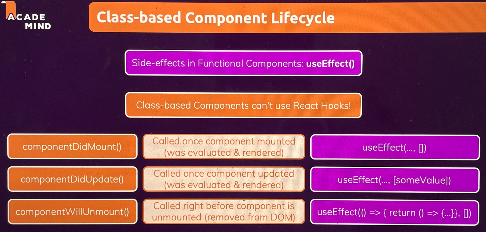

# __:material-react: React__

## Key features

- __JSX__: A syntax extension that allows writing HTML in JavaScript.
- __Components__: Reusable and independent building blocks of the UI.
- __Virtual DOM__: A lightweight representation of the real DOM that improves performance by updating only the changed parts.
- __One-Way Data Binding__: Data flows in one direction, making the application more predictable.
- __State and Props__: Enables dynamic and interactive UIs.
- __Lifecycle Methods__: Methods like componentDidMount or useEffect that run during specific phases of a component's lifecycle.

??? note "Virtual DOM"

    The Virtual DOM is a lightweight JavaScript representation of the real DOM. When a React component updates, React calculates the difference between the current Virtual DOM and the new Virtual DOM, and updates only the changed elements in the real DOM, improving performance.

## Setup

- Simplify react setup by using `create-react-app` cli tool.

  ```bash title="create-react-app"
  # install as global dependency
  npm install -g create-react-app

  # using binary to create react apps
  npx create-react-app react-tutorial
  ```

- Use `generate-react-cli` to streamline and automate the process of creating React components, pages, and other related files within a React project.

  ```bash title="generate-react-cli"
  cd react-tutorial
  # install as a project development dependency
  npm install generate-react-cli --save-dev

  # using binary to create components
  npx generate-react-cli component MyComponent

  npx generate-react-cli component MyComponent --type page
  ```

??? info "`generate-react-cli.json` config"

    ```json
      // (1)!
      {
        "usesTypeScript": false,
        "usesStyledComponents": false,
        "usesCssModule": false,
        "cssPreprocessor": "css",
        "testLibrary": "None",
        "component": {
          "default": {
            "path": "src/components",
            "withStyle": false,
            "withTest": false,
            "withStory": false,
            "withLazy": false
          },
          "page": {
            "path": "src/pages",
            "withStyle": false,
            "withTest": false,
            "withStory": false,
            "withLazy": false
          }
        }
      }
    ```

    1.  - `path`: Where to create components (relative to project root)
        - `extension`: File extension: `"js"`, `"jsx"`, `"ts"`, or `"tsx"`
        - `type`: component type
            - `"default"`: A basic functional component (with named export)
            - `"pure"`: A functional component using React.memo() for performance optimization
            - `"class"`: A class-based React component (ES6 class extending React.Component)
        - `withStyle`: If `true`, creates a CSS (or SCSS/module.css) file
        - `style`: `"css"`, `"scss"`, `"module.css"`, `"module.scss"`
        - `withTest`: If `true`, generates a test file
        - `withStory`: If `true`, generates a Storybook file
        - `withLazy`: If `true`, wraps the component in `React.lazy()` with `index.js` as entry point

??? note "`npm` v/s `npx`"

    `npm` is used to:

    - Install packages (locally or globally)
    - Manage dependencies in package.json
    - Run scripts defined in package.json

    `npx` is used to:

    - Run Node.js CLI tools without installing them permanently
    - Run locally installed CLI tools from `node_modules/.bin`

## Component Types

1) Controlled vs. Uncontrolled Components

   - __Controlled__: Components where the state is managed by React using useState or similar.
   - __Uncontrolled__: Components where the state is managed by the DOM itself.

2) Stateful vs. Stateless Components

   - __Stateful__: Components that manage their own state.
   - __Stateless__: Components that do not manage their own state (purely presentational).

## Styling

``` jsx title="dynamic styling"
<input type="text" style={{
  color: !isValid ? 'red' : 'black', 
  height: '80%', backgroundColor: 'red'}}/>

<input type="text" className={`form-control ${!isValid ? 'invalid' : ''}`}/>
```

- React provides, ==scoping== a css file to a specific component. To avoid styling conflicts.

``` css title="MainNavigation.module.css"
.header {
  background: black;
}
```

``` jsx title="MainNavigation.js"
import classes from './MainNavigation.module.css';


const MainNavigation = () => (
  <header className={classes.header}>
    <div>React Meetups</div>
    <nav>
      <ul>
        <li><Link to='/'>All Meetups</Link></li>
        <li><Link to='/new-meetup'>Add New Meetup</Link></li>
        <li><Link to='/favorites'>My Favorites</Link></li>
      </ul>
    </nav>
  </header>
);
```


## Dynamic Rendering

- Pass key while rendering lists for performance and avoid bugs related to states.
- Also, use custom id for list items

``` jsx
function Example() {
    const [states, setStates] = useState(['MI', 'MA', 'VA', 'MD']);

    return (
        <div>
            {/* Conditional Rendering */}
            {states.length === 0 && (<p>No states to show</p>)}

            {/* List Rendering */}
            {states.length > 0 && (states.map((item, index) => <ol key={index}>item</ol>))}

            {/* Alternate Approach */}
            {
                states.length > 0 ?
                    states.map((item, index) => (
                      <li key={index}>item</li>
                    )) : (<p>No states to show</p>)
            }
        </div>
    );
}
```


## Events

- All HTML elements used in React are a wrapper on standard HTML elements. Thus, we must use component properties instead of HTML attributes(e.g use `className=""` instead of `class=""`).
- React events use camelCase (e.g., `onClick`, `onChange`) and accept a function reference — not a string like in plain HTML.

| Event Name | Trigger | Element Type |
| --- | --- | --- |
| `onClick` | Element is clicked | Any |
| `onChange` | Input value changes | `<input>`, `<select>`, `<textarea>` |
| `onSubmit` | Form is submitted | `<form>` |
| `onMouseEnter` | Mouse enters an element | Any |
| `onMouseLeave` | Mouse leaves an element | Any |
| `onFocus` | Element receives focus | Input/form |
| `onBlur` | Element loses focus | Input/form |
| `onKeyDown` | Key is pressed | Any |
| `onKeyUp` | Key is released | Any |

```jsx title="examples"
FormComponent = () => {
    const submitHandler = (event) => {
        event.preventDefault();
    }

    const confirmHandler = (event) => {
        event.preventDefault();
    }

    return (
        <form onSubmit={submitHandler}>
            <button type="submit">Add</button>
            <button onClick={confirmHandler}>Confirm</button>
        </form>
    );
}
```

## Props

- props are used to pass data to child components.
- `children` is a default property in React used to pass nested content. Generally used in wrapper components.

=== "Functional Component"

    ``` jsx title="App.js"
    // App.js
    const App = () => {
      return (
        <div>
          <h1>My Todos</h1>
          // children prop passed by default
          <div className="">{props.children}</div>
          <Todo title="Learn React" />
        </div>
      );
    }
    ```

    ``` jsx title="Todo.js"
    const Todo = (props) => {
      const deleteHandler = (event) => {
        console.log(event);
      }

      return (
        <div className='card'>
          <h2>{props.title}</h2>
          <div className='actions'>
            <button className='btn' onClick={deleteHandler}>Delete</button>
          </div>
        </div>
      );
    };
    ```

=== "Class Component"

    ```jsx title="Counter.js"
    class Counter extends React.Component {
      constructor(props) {
        super(props);
      }

      render() {
        // children prop passed by default
        return <div}>{this.props.children}</div>;
      }
    }
    ```


## State

- State's are immutable. i.e updating the state directly may not trigger react re-render or lifecycle hooks.

### Parent-to-Child communication

=== "Functional Component"

    - React monitors the state by references and not values. Thus for changes to take effect `useState`.

    ``` jsx title="Todo.js"
    const Todo = (props) => {
      // const [ stateVariable, updateFunc ] = useState(initalValue);
      const [modalVisible, setModalVisibility] = useState(false);

      const deleteHandler = (event) => {
        setModalVisibility(true);
      }

      const closeModal = (event) => {
        setModalVisibility(false);
      }

      return (
        <div className='card'>
          <h2>{props.title}</h2>
          <div className='actions'>
            <button className='btn' onClick={deleteHandler}>Delete</button>
          </div>
          { modalVisible && <Modal onCancel={closeModal} onConfirm={closeModal}/> }
          { modalVisible && <Backdrop onCancel={closeModal}/> }
        </div>
      );
    };
    ```

=== "Class Component"

    ```jsx title="Counter.js"
    class Counter extends React.Component {
      constructor(props) {
        super(props);
        this.state = { count: 0 };
      }

      increment = () => {
        this.setState({ count: this.state.count + 1 });
      };

      render() {
        return <button onClick={this.increment}>{this.state.count}</button>;
      }
    }
    ```


### Child-to-Parent communication

In React, child components can communicate with parent components via callback functions passed as props.

```jsx
// De-Structuring
// {prop1, prop2, prop2} = props
const Child = ({updateState}) => {
  return <button onClick={updateState('Child')}></button>
}

const Parent = () => {
  const [name, setName] = useState('Parent');

  handleUpdateState = (value) => {
    setName(value);
  }

  return <Child updateState={handleUpdateState}></Child>
}
```


## Component Lifecycles

React components go through different lifecycle phases during their existence. These phases are particularly relevant for class components but can also be mapped to functional components using hooks like `useEffect`.

<figure markdown="span">
  { width="600" }
  <figcaption>Component Lifecycle</figcaption>
</figure>

=== "Class Components"

    === "__Mounting Phase__"
        The mounting phase occurs when a component is being created and inserted into the DOM.

        ??? info "`#!jsx constructor()`"
            - Invoked before the component is mounted.
            - Used for initializing state and binding event handlers.

            ```jsx
            constructor(props) {
              super(props);
              this.state = { counter: 0 };
            }
            ```

        ??? info "`#!jsx static getDerivedStateFromProps()`"
            - Invoked before render.
            - Allows the component to update its state based on props.

            ```jsx
            static getDerivedStateFromProps(nextProps, prevState) {
              if (nextProps.initialCount !== prevState.prevState.internalCount) {
                return { internalCount: nextProps.initialCount };
              }
              return null;
            }
            ```

        ??? info "`#!jsx render()`"
            - The only required method in a class component.
            - Describes the UI structure.

            ```jsx
            render() {
              return <h1>{this.state.counter}</h1>;
            }
            ```

        ??? info "`#!jsx componentDidMount()`"
            - Invoked after the component is mounted to the DOM.
            - Ideal for side effects like API calls, subscriptions, or setting up event listeners.

            ```jsx
            componentDidMount() {
              fetch('/api/data').then(response => response.json());
            }
            ```

    === "__Updating Phase__"
        The updating phase occurs when a component is re-rendered due to changes in state or props.
        ??? info "`#!jsx static getDerivedStateFromProps()`"
            - Invoked when props change. It can update the state based on new props (rarely used).

        ??? info "`#!jsx shouldComponentUpdate()`"
            - Invoked before rendering. Determines if a re-render is needed.
            - Returns a boolean (true by default).

            ```jsx
            shouldComponentUpdate(nextProps, nextState) {
              return nextState.counter !== this.state.counter;
            }
            ```

        ??? info "`#!jsx render()`"
            - Re-renders the component.

        ??? info "`#!jsx getSnapshotBeforeUpdate()`"
            - Called just before the DOM is updated.
            - Allows capturing information about the DOM (e.g., scroll position).

            ```jsx
            getSnapshotBeforeUpdate(prevProps, prevState) {
              return { scrollTop: document.documentElement.scrollTop };
            }
            ```

        ??? info "`#!jsx componentDidUpdate()`"
            - Invoked after the DOM is updated.
            - Useful for performing side effects after updates, like making network requests.

            ```jsx
            componentDidUpdate(prevProps, prevState, snapshot) {
              if (prevState.counter !== this.state.counter) {
                console.log('Counter updated!');
              }
            }
            ```

    === "__Unmounting Phase__"
        This phase occurs when a component is removed from the DOM.
        ??? info "`#!jsx componentWillUnmount()`"
            - Invoked immediately before a component is unmounted and destroyed.
            - Used for cleanup tasks like removing event listeners, canceling network requests, or clearing timers.

            ```jsx
            componentWillUnmount() {
              clearInterval(this.timer);
            }
            ```

    === "__Error Handling Phase__"
        This phase is triggered when an error occurs during rendering, lifecycle methods, or constructors of child components.
        ??? info "`#!jsx static getDerivedStateFromError()`"
            - Invoked after an error is thrown.
            - Updates state to display an error UI.

            ```jsx
            static getDerivedStateFromError(error) {
              return { hasError: true };
            }
            ```

        ??? info "`#!jsx componentDidCatch()`"

            - Invoked after an error is thrown in a child component.
            - Used for logging error information
            - It can wrap around components to handle the error globally/aggregate error handling for set of components.
            - ==No equivalent for functional components==

            ```jsx
            componentDidCatch(error, info) {
              logErrorToService(error, info);
            }
            ```

            ```jsx title="Use case"
            class ErrorBoundry extends Component {
                constructor() {
                    super();
                    this.state = { hasError: false };
                }

                componentDidCatch(error) {
                    console.log(error);
                    this.setState({ hasError: true });
                }

                render() {
                    return (this.state.hasError ? (<p>Something went wrong</p>) : this.props.children);
                }
            }

            function ChildComponent {
                handleClick = () => {
                    throw new Error("Error from child Component");
                }

                return(
                    <button onClick={handleClick}>Throw error</button>
                );
            }


            return (
                <ErrorBoundry>
                    // ChildComponent thow
                    <ChildComponent ...props>
                </ErrorBoundry>
            );
            ```


=== "Functional Components"
    For functional components, React hooks like useEffect can mimic lifecycle behaviors:

    ??? danger "On every render"

        - Be careful not to change the state in this case.
        - Changing state causes re-rendering, which inturn triggers rendering.

        ```jsx
        useEffect(() => {
          setLocalState1();         // ❌ will create a loop
          console.log('Component updated'); 
        });
        ```

    ??? info "Mounting Phase"

        ``` jsx
        useEffect(() => {
          console.log('Component mounted');
        }, []);
        ```

    ??? warning "When state/prop changes"

        - React tracks changes using reference equality (===)
            - `user.name` is a primitive string, so React can tell when it changes.
            - Including `user.name` is usually sufficient, not `user`.
        - However,
            - If `user` is recreated (new reference) on every render, then `[user.name]` won’t detect the change — but `[user]` will.
            - If `user.name` is nested (e.g. `user.profile.name`) and `user.profile` changes, React won’t catch that unless you include the deeper object.

        ``` jsx title="simple states"
        useEffect(() => {
          console.log(count);                   // state: count
        }, [count]);
        ```

        ``` jsx title="complex states"
        useEffect(() => {
          console.log(user.profile.name);       // state: user = { profile: {name: } }
        }, [user.profile.name]);
        ```

    ??? info "Unmounting Phase"

        - Before every re-run and on unmount

        ```jsx
        useEffect(() => {
          return () => {
            console.log('Component will unmount');
          };
        }, []);

        // or

        useEffect(() => {
          console.log(user.profile.name);

          // Cleanup runs: logs 'Component will unmount' (for old 'Alice')
          // Then effect re-runs: logs 'Bob'
          return () => {
            console.log('Component will unmount');
          };
        }, [user.profile.name]);
        ```


## Hooks

They let you use state and other React features without writing a class(i.e functional components)

### `useState`

- `useState` returns a pair, the current state value and a function that lets you update it.

??? warning

    - Similar to `this.setState` in a class, except it doesn’t merge the old and new state together. Hence, if current state depends on previous state.
    - React doesn't update states instantaneously, but schedule's them.
    - Thus, if currentState depends on previous state. It may get stale data for previous state.

    ```jsx
    // Not recommended
    // This approach may return stale data as react schedule's state updates
    setUserInput({
        ...userInput,
        lastName: 'test'
    });
    ```

```jsx hl_lines="12-21"
const Example = () => {
    // Declare a new state variable
    const [userInput, setUserInput] = useState({
        title: '',
        firstName: '',
        lastName: ''
    });
    
    const [hasUpdate, setHasUpdate] = useState(false);

    handleClick = () => {
        // If current state is dependent on previous state
        setUserInput((prevState) => {
            return {
                ...prevState,
                lastName: 'test'
            };
        });

        // If current state is independent of previous state
        setHasUpdate(false);
    };

    return (
        <div>
            <p>You clicked {count} times</p>
            <button onClick={() => handleClick()}>
                Click me
            </button>
        </div>
    );
}
```

### `useRef`

- To access DOM elements by referencing a HTML tag.
- Suitable, to read input values from forms once during submission. Rather than monitoring every `<input />` keystroke.
- Store mutable values that persist across renders without causing re-renders

??? note "Accesing DOM elements"

    ```jsx
    import React, { useRef } from 'react';
    const Example = () => {
      const nameInputRef = useRef();

      handleClick = () => {
        // The node element can be found in the current property
        console.log(nameInputRef.current.value);
      }

      return (
        <div>
          <input type="text" ref={nameInputRef} />
          <button onClick={handleClick}></button>
        </div>
      );
    }
    ```

??? note "Persisting values across renders"

    ```jsx hl_lines="1-2 5-8 12"
    const PreviousStateExample = () => {
      const intervalRef = useRef();
      const expensiveValue = useRef(calculateOnce());

      useEffect(() => {
        // intervalId = setInterval({}); ❌ Won’t work as expected
        // intervalId is re-declared every time the component function runs.
        // Thus intervalId is not persisted. Causing memory leaks
        intervalRef.current = setInterval(() => {
          console.log('Tick');
        }, 1000);

        return () => clearInterval(intervalRef.current);
      }, []);

      return (
        <div>
          <p>Value: {expensiveValue.current}</p>;
          <p>Current: {count}</p>
          <p>Previous: {prevCount.current}</p>
          <button onClick={() => setCount(count + 1)}>Increment</button>
        </div>
      );
    }

    function calculateOnce() {
      console.log("Heavy calculation...");
      return 42;
    }
    ```

### `useEffect`

- It serves the same purpose as `componentDidMount`, `componentDidUpdate`, and `componentWillUnmount` in React classes, but unified into a single API. ex:  `useEffect(() => {...}, [dependencies])}`
- It runs after every component evaluation,, if the specified dependencies changes.

```jsx
import { useEffect, useState } from 'react';

let myTimer;

const MyComponent = (props) => {
  const [timerIsActive, setTimerIsActive] = useState(false);

  const { timerDuration } = props; // using destructuring to pull out specific properties

  useEffect(() => {
    if (!timerIsActive) {
      setTimerIsActive(true);
      myTimer = setTimeout(() => {
        setTimerIsActive(false);
      }, timerDuration);
    }
  }, [timerIsActive, timerDuration]);
};

// Runs every time component renders
useEffect(() => {});

// Runs only once, right after component mounts
useEffect(() => {}, []);

// Runs whenever dependency changes
useEffect(() => {}, [...dependencies]);
```

??? warning "Why useMemo and useCallback?"

    In React: Functions and objects are recreated on every render.

    - This can cause unwanted re-renders in child components or expensive recalculations
    - `useMemo` and `useCallback` help memoize values/functions so they only change when needed.

### `useMemo`

- Caches the result of a calculation until dependencies change.
- Memoize Expensive Values

```jsx hl_lines="5 9 11"
import { useMemo, useState } from 'react';

// 🔥 Without useMemo, React would recalculate on every render, even if n hasn't changed.
const Fibonacci = ({ n }) => {
  const fib = useMemo(() => {
    console.log("Calculating Fibonacci...");
    const calc = (n) => (n <= 1 ? n : calc(n - 1) + calc(n - 2));
    return calc(n);
  }, [n]);

  return (<div>Result of Fibonacci({n}) = {fib}</div>);
}
```

### `useCallback`

- Caches the function definition so it doesn’t get recreated on every render.

```jsx hl_lines="8 10 15 21"
import { useState, useCallback } from 'react';

const Parent = () => {
  const [count, setCount] = useState(0);

  // 🔥 Without useCallback: handleClick is a new function every render
  // Child will re-render even if props didn’t change
  const handleClick = useCallback(() => {
    console.log("Clicked");
  }, []);

  return (
    <div>
      <button onClick={() => setCount(count + 1)}>Re-render</button>
      <Child onClick={handleClick} />
    </div>
  );
}

const Child = ({ onClick }) => {
  return <button onClick={onClick}>Child Button</button>;
}
```

??? warning "`React.memo`"

    - `React.memo` is a higher-order component that tells React: Only re-render this component if its `props` have changed
    - It memoizes the result of the render — like caching — and skips rendering if props are the same as last time.

    ```jsx hl_lines="12 18"
    const Parent = ({ count }) => {
      const [text, setText] = useState("");

      return (
        <div>
          <input onChange={(e) => setText(e.target.value)} />
          <Child count={count} />
        </div>
      );
    }

    // Re-renders everytime parent renders regardless whether props changes or not
    // const Child = ({ count }) => {
    //   console.log("Child rendered");
    //   return <div>Count: {count}</div>;
    // }

    const Child = React.memo(function Child({ count }) {
      console.log("Child rendered");
      return <div>Count: {count}</div>;
    });
    ```


## Fragment

- Using Fragments to Avoid Unnecessary Wrappers

```jsx
import React, { Fragment } from 'react';
function Example() {
    return (
        // avoid unnecessary div's
        <Fragment>
            <AddUser onAddUser={}></AddUser>
            <UserList items={}></UserList>
        </Fragment>
    );
}
```


## Higher-Order Component (HOC)

- A Higher-Order Component is a function that takes a component and returns a new component with additional functionality.
- Classic use case: conditional rendering of components based on authentication and authorizaton.

```jsx
// withAuthProtection.js
const withAuthProtection = (WrappedComponent) => {
  return function ProtectedComponent(props) {
    // ...
    if (!isLoggedIn) {
      return <p>Access denied. Please log in.</p>;
    }

    return <WrappedComponent {...props} />;
  };
}

// Dashboard.js
const Dashboard = () => {
  return <h2>Welcome to the dashboard!</h2>;
}

// App.js
const ProtectedDashboard = withAuthProtection(Dashboard);

const App = () => {
  // ...
  return (
    <div>
      <h1>🔐 React withAuthProtection HOC Demo</h1>
      <ProtectedDashboard />
    </div>
  );
}
```


## Portal

- In React, components render inside a parent DOM node. But sometimes you want to:
  - Render content outside that DOM tree
  - Avoid CSS overflow, z-index, or stacking issues
  - Create modal-like UIs that aren't clipped or constrained

```jsx title="index.html"
<body>
  <div id="root"></div>
  <div id="modal-root"></div> <!-- 👈 Outside root hierarchy -->
</body>
```
```jsx title="Modal.js"
// Create a portal to render modal content outside the parent component
const Modal = ({ children, onClose }) => {
  return ReactDOM.createPortal(
    <div style={styles.overlay} onClick={onClose}>
      <div style={styles.modal} onClick={(e) => e.stopPropagation()}>
        {children}
      </div>
    </div>,
    document.getElementById('modal-root') // 👈 renders outside app
  );
}
```
```jsx title="App.js"
const App = () => {
  const [showModal, setShowModal] = useState(false);

  return (
    <div>
      <h1>Main App</h1>
      <button onClick={() => setShowModal(true)}>Open Modal</button>

      {showModal && (
        <Modal onClose={() => setShowModal(false)}>
          <h2>This is a Portal Modal</h2>
          <button onClick={() => setShowModal(false)}>Close</button>
        </Modal>
      )}
    </div>
  );
}
```


## Routing

- `BrowserRouter` initializes the `App` component with routing capabilities.
- `Route` componet listens on url events to render the necessary component at the specified location.

```jsx
import { BrowserRouter, Route } from 'react-router-dom';

root.render(
  <BrowserRouter>
    <App />
  </BrowserRouter>
);

const App = () => {
  return (
    <div>
      // matches all /welcome/*
      <Route path="/welcome"><Welcome /></Route>
      // matches all /products/*
      <Route path="/products"><Products /></Route>
      // matches all /products/productId/* paths
      <Route path="/products/:productId"><ProductDetail /></Route> 
    </div>
  );
}
```


### Switch/Routes

- Renders one active route at a time. 2 Types:
- `<Switch>`:
    - Renders first match.
    - Children must be `<Route>`
- `<Routes>`:
    - Renders best match
    - Children must be <Route> with element prop

=== "Routes (v6+)"

    ```jsx hl_lines="7 13 16"
    import { Routes, Route, Navigate } from 'react-router-dom';
    const App = () => {
      return (
        <div>
          <Routes>
            // Redirect from `/` to `/welcome`
            <Route path="/" element={<Navigate to="/welcome" replace />} />

            // Static route
            <Route path="/welcome" element={<Welcome />} />

            // Products main page
            <Route path="/products" element={<Products />} />

            // Product detail route with path param
            <Route path="/products/:productId" element={<ProductDetail />} />
          </Routes>
        </div>
      );
    };
    ```

=== "Switch Deprecated(v6)"

    - `<Redirect />` redirects to a different route.
    - In the example below, `/products/p1` url match `<Products />` and `<ProductDetails />`. But, Switch renders just one, the first one `<Products />`.
    - In actuality, `/products/p1` should render only `<ProductDetails />`. Solution, `exact`, which can check for an exact url match.

    ```jsx hl_lines="7-12"
    import { Switch, Route, Redirect } from 'react-router-dom';

    const App = () => {
      return (
        <div>
          <Switch>
            // In this case since everthing matches `/`, we will get an infinite loop.
            // As `/` -> `/welcome` -> `/` ...
            // Solution:
            <Route path="/" exact>
              <Redirect to="/welcome" />
            </Route>
            <Route path="/welcome"><Welcome /></Route>
            
            <Route path="/products" exact><Products /></Route>           // matches: `/products*`
            <Route path="/products/:productId"><ProductDetail /></Route> // matches: `/products/*`
         </Switch>
        </div>
      );
    }
    ```


### Link and NavLink

- Rather than typing the urls on browser address bar to render the necessary components. We would like navigable `<a>` tags.
- `<Link>`, `<NavLink>` provides this capability. Both,creates an `<a>` tag implicitly.

```jsx
<nav>
  <ul>
    <li><Link to="/welcome">Welcome</Link></li>
    <li><Link to="/products">Welcome</Link></li>

    // NavLink can be used to provide custom styling to active link
    <li><NavLink activeClassName="active" to="/orders">Orders</NavLink></li>
    <li><NavLink activeClassName="active" to="/users">Users</NavLink></li>
  </ul>
</nav>
```


### Path and Query Parameters

- `useParams`: Can get path params(e.g. `/products/:productId/:userId`)
- `useLocation`: Use it to:
    - Access the current URL. e.g. `location.pathname`
    - Read query parameters (?key=value). e.g. `location.search`

```jsx hl_lines="5 8 12-13" title="URL: /products/:productId/:userId?sort=asc"
import { useParams, useLocation } from 'react-router-dom';

const ProductDetail = () => {
  // path params
  const params = useParams();

  // Extract query params
  const queryParams = new URLSearchParams(useLocation().search);

  return (
    <div>
      <h1>{params.userId}. This is the Product: {params.productId}</h1>
      <p>Dorting order {queryParams.get('sort')}</p>
    </div>
  );
}
```


### Nested Route

``` jsx
// `/welcome` -> <Welcome />
const Welcome = () => {
  return (
    <section>
      <h1>Welcome Page</h1>
      // Nested Route: This Route is evaluted if `/welcome` route is active
      // `/welcome/new-user` -> <NewUser /> in <Welcome /> component
      <Route path="/welcome/new-user">
        <h1>Welcome, new user!</h1>
      </Route>
    </section>
  );
}
```


### Programatic Navigation

- ==Browser's maintain a navigation history stack==. Navigation history can be pushed to this stack.
- We can use browser Back/Forward button to traverse history.

=== "[useNavigate( v6+)](https://reactrouter.com/en/main/hooks/use-navigate)"

    ```jsx title="useNavigate"
    import { useNavigate } from "react-router-dom";

    const navigate = useNavigate();

    navigate("/quotes");                        // push to history 

    navigate("/quotes", { replace: true });     // replaces history instead of pushing
    ```

=== "useHistory Deprecate(v6)"

    ```jsx title="useHistory - Deprecated"
    import { useHistory } from "react-router-dom";
    const history = useHistory();

    history.push("/quotes");            // push to history 

    history.replace("/quotes");         // replaces history instead of pushing

    history.goBack();
    ```


## App-wide State Management

- 2 options: Context or Redux.
- ==Both states live in memory only.==
- For persistent state use either Context/Redux with localStorage/sessionStorage/Cookies.

| Source         | Survives Page Reload?       | Notes                      |
| -------------- | --------------------------- | -------------------------- |
| React Context  | ❌ No                        | Lives in memory only       |
| Redux Store    | ❌ No                        | Lives in memory only       |
| localStorage   | ✅ Yes                       | Persistent across sessions |
| sessionStorage | ✅ Yes (until tab is closed) | Clears on tab close        |
| Cookies        | ✅ Yes (configurable)        | Good for tokens/auth       |

### Context

- Context provides a way to pass data through the component tree without passing props manually at every level.
- Use it only for global/shared state, not all component state.
- On any change, all consumers re-render.
- Manual Async logic.
- Great for:
    - Theme toggles
    - Auth status
    - Language settings
    - User object

```jsx
import { createContext, useState } from "react";

const AuthContext = createContext({
  user: null
});

const AuthContextProvidor = (props) => {

  const [user, setUser] =  useState(null);

  const addUser = () => {
    const storedUser = localStorage.getItem('user');
    if (storedUser) setUser(JSON.parse(storedUser));
  }

  const removeUser = () => {
    localStorage.removeItem('user');
    setUser(null);
  }

  const context = {
    user: user,
    addUser: addUser,
    removeUser: removeUser
  };

  // When the value prop of the provider changes
  // React will re-render all consumers of that context
  return (
    <AuthContext.Provider value={context}>
      {props.children}
    </AuthContext.Provider>
  );
}

const App = () => {
  const [theme, setTheme] = useState('light');

  return (
    <AuthContextProvidor>
      <Toolbar />
    </AuthContextProvidor>
  );
}

const Toolbar = () => {
  const userContext = useContext(AuthContext);
  // Logic
  return (
    <div>
      {userContext.user && <span>{userContext.user}</span>}
      <button onClick={userContext.addUser}>Login</button>
      <button onClick={userContext.removeUser}>Logout</button>
    </div>
  );
}
```


### Redux

- External state management library.
- Provides application wide immutable store.

=== "`redux` Implementation"

    - ==Vanilla Redux (Non-React)==: Use this library without react.

    ```jsx title="reducers/counterReducer.js"
    //                     (initialState, action)
    const counterReducer = (state = { counter: 0, showCounter: true }, action) => {
      switch (action.type) {
        // Return a cloned verions of the state
        case "INCREASE": return {
          counter: (state.counter + action.amt),
          showCounter
        }
        case "TOGGLE": return {
          counter: state.counter,
          showCounter: !state.showCounter
        }
      }
      return state;
    }

    export default counterReducer;
    ```
    ```jsx title="store.js"
    import { createStore, combineReducers } from 'redux';
    import counterReducer from './reducers/counterReducer';

    const rootReducer = combineReducers({
      counter: counterReducer
    });

    const store = createStore(rootReducer);

    export default store;
    ```
    ```jsx title="example"
    // Subscribing to a state
    store.subscribe(() => {
      const state = store.getState();
      console.log(state);
    });

    store.dispatch({ type: "INCREMENT" });
    ```

=== "`react-redux` Implementation"

    ```jsx title="reducers/counterReducer.js"
    //                     (initialState, action)
    const counterReducer = (state = { counter: 0, showCounter: true }, action) => {
      switch (action.type) {
        // Return a cloned verions of the state
        case "INCREASE": return {
          counter: (state.counter + action.amt), showCounter
        }
        case "TOGGLE": return {
          counter: state.counter,
          showCounter: !state.showCounter
        }
      }
      return state;
    }

    export default counterReducer;
    ```
    ```jsx title="store.js"
    import { createStore, combineReducers } from 'redux';
    import counterReducer from './reducers/counterReducer';

    const rootReducer = combineReducers({
      counter: counterReducer
    });

    const store = createStore(rootReducer);

    export default store;
    ```
    ```jsx title="index.js"
    import { Provider } from 'react-redux';
    import store from './store'; // 👈 your created store

    // Add provider, such that all nested components has access to the store
    // Hence generally added to App(Root) component
    const root = ReactDOM.createRoot(document.getElementById('root'));
    root.render(
      <Provider store={store}>
        <App />
      </Provider>
    );
    ```

    ```jsx title="Counter.js"
    import { Provider, useSelector, useDispatch } from 'react-redux';

    const Counter = () => {
      // get's and subscribe's to the state
      const counter = useSelector(state => state.counter);
      const showCounter = useSelector(state => state.showCounter);
      const dispatch = useDispatch();

      const increaseHandler = () => {
        dispatch({ type: "INCREASE", amt: 5 });
      }

      const toggleHandler = () => {
        dispatch({ type: "TOGGLE" });
      }

      return (
        <div>
          Counter
          {showCounter && <span>{counter}</span>}
          <button onClick={increaseHandler}>Increase by 5</button>
          <button onClick={toggleHandler}>Toggle Counter</button>
        </div>
      );
    }

    export default Counter;
    ```

    !!! warning "Limitations of `react-redux`"

        - Could lead to misspelled or use of wrong action identifiers when working on a project with multiple actions and multiple developer contribution. Could be avoided by spelling action identifiers correctly
        - Since states are immutable. We return a cloned state with the necessary updates, and as the state get complex so does the reducer. This could lead to unmanageable code
        - No modularization of reducers


=== "`redux/toolkit` Implementaion"

    - Another library that address the above mentioned short comings of `react-redux`

    ```jsx title="counterSlice.js" hl_lines="8-9"
    import { createSlice, configureStore } from '@reduxjs/toolkit';

    const counterSlice = createSlice({
      name: 'counter',
      initialState: { counter: 0, showCounter: true },
      reducers: {
        increase(state, action) {
          // redux/toolkit comes with Immer. which intercepts this
          // and clones the state for us
          state.counter = state.counter + action.payload;
        },
        toggle(state) {
          state.showCounter = !state.showCounter;
        }
      }
    });
    export const counterActions = counterSlice.actions; // ✅ named export for actions
    export default counterSlice.reducer;                // ✅ default export reducer
    ```
    ```jsx title="store.js"
    import { configureStore } from '@reduxjs/toolkit';
    import counterReducer from './store/counterSlice'; // 👈 correct import path and reducer

    const store = configureStore({
      reducer: {
        // counterReducer key -> counter
        counter: counterReducer
      }
    });

    export default store;
    ```
    ```jsx title="index.js" hl_lines="4-5"
    import { Provider } from 'react-redux';
    import store from './store'; // 👈 your created store

    // Including Provider at the top of component hierarchy
    // ensure all componets can subscribe to the state
    const root = ReactDOM.createRoot(document.getElementById('root'));
    root.render(
      <Provider store={store}>
        <App />
      </Provider>
    );
    ```
    ```jsx title="Counter.js" hl_lines="5-6 12 16"
    import { useSelector, useDispatch } from 'react-redux';
    import { counterActions } from './store/counterSlice'; // 👈 import actions

    const Counter = () => {
      // Get's and Subscribe's to the required state
      // state.<store_reducer_key>.<properties>
      const counter = useSelector(state => state.counter.counter);
      const showCounter = useSelector(state => state.counter.showCounter);
      const dispatch = useDispatch();

      const increaseHandler = () => {
        dispatch(counterActions.increase(5));
      }

      const toggleHandler = () => {
        dispatch(counterActions.toggle());
      }

      return (
        <div>
          Counter
          {showCounter && <span>{counter}</span>}
          <button onClick={increaseHandler}>Increase by 5</button>
          <button onClick={toggleHandler}>Toggle Counter</button>
        </div>
      );
    }

    export default Counter;
    ```