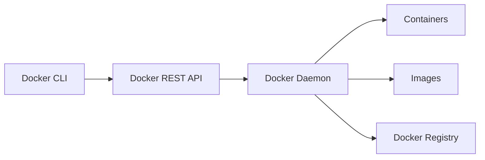
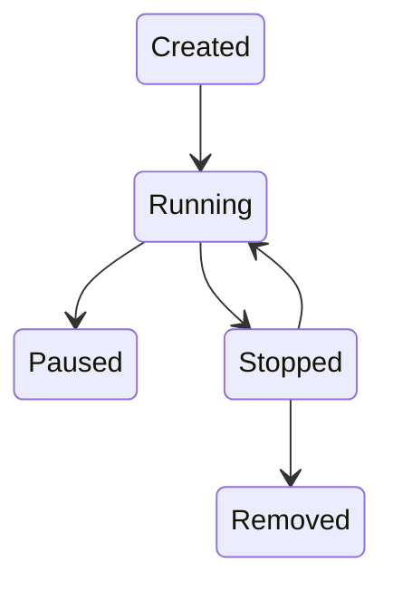

# __:simple-docker:{.lg .top} Docker__

## Introduction

Docker is a containerization platform that enables developers to package applications and dependencies into lightweight, portable containers.

!!! info "Why Docker?"

    - Consistent environments across dev, staging, and production
    - Faster deployments
    - Lightweight compared to VMs
    - Microservices friendly
    - Scalable and cloud-native ready



### Docker vs Virtual Machines

=== "Docker (Containers)"

    - Shares host OS kernel
    - Lightweight
    - Starts in seconds
    - Low resource usage

=== "Virtual Machines"

    - Full OS per VM
    - Heavy
    - Slower boot time
    - Higher resource usage

!!! tip

    Containers use OS-level virtualization while VMs use hardware-level virtualization.

## Docker Image

An image is a read-only layered template used to create containers. Docker image specifications are written on a Dockerfile

```dockerfile
FROM python:3.11
WORKDIR /app
COPY requirements.txt .
RUN pip install -r requirements.txt
COPY . .
CMD ["python", "app.py"]
```

!!! note "Layer Caching"

    Docker caches layers. Reordering instructions can optimize build speed.

### Multi-Stage Builds

```dockerfile
# Build Stage
FROM node:20 AS builder
WORKDIR /app
COPY package*.json ./
RUN npm install
COPY . .
RUN npm run build

# Production Stage
FROM nginx:alpine
COPY --from=builder /app/dist /usr/share/nginx/html
```

!!! success

    Multi-stage builds reduce image size significantly.

__Commands:__

??? info "`FROM`"

    Defines the __base image__ for the build.

    - Must be the __first instruction__ (except `ARG`)
    - Can be used multiple times (multi-stage builds)

    ```dockerfile
    FROM node:20 AS builder
    WORKDIR /app
    COPY . .
    RUN npm install && npm run build

    FROM nginx:alpine
    COPY --from=builder /app/dist /usr/share/nginx/html
    ```

??? info "`LABEL`"

    Adds metadata to the image.
    Use labels for:
        - version
        - description
        - maintainers
        - git commit SHA

    ```dockerfile
    LABEL maintainer="test@example.com"
    ```

??? info "`ARG`"

    Build-time variable.
    - `ARG` is __not available at runtime__ unless passed to `ENV`.

    ```dockerfile
    ARG APP_VERSION=1.0
    ```

??? info "`RUN`"

    Executes commands during build and creates a new layer.
    - Combine commands with `&&` to reduce layers.

    ```dockerfile
    RUN apt-get update && \
        apt-get install -y curl && \
        rm -rf /var/lib/apt/lists/*
    ```

??? info "`CMD`"

    Default command executed at container start.

    - Only __one CMD__ allowed (last one wins)
    - Can be overridden by `docker run`

    ```dockerfile
    # CMD python app.py
    # or
    CMD ["python", "app.py"]
    ```

??? info "`ENTRYPOINT`"

    Defines a fixed executable.

    Difference `ENTRYPOINT` vs `CMD`:
    
    - `ENTRYPOINT` → main command
    - `CMD` → default arguments

    ```dockerfile
    ENTRYPOINT ["python"]
    CMD ["app.py"]
    ```

??? info "`WORKDIR`"

    Sets working directory for subsequent commands.

    - Automatically creates the directory if it does not exist.

    ```dockerfile
    WORKDIR /app
    ```

??? info "`COPY`"

    Copies files from host to container.

    - Preferred over `ADD`
    - Supports multi-stage copy

    ```dockerfile
    COPY requirements.txt .
    COPY --from=builder /app/dist ./dist
    ```

??? info "`ADD`"

    Similar to `COPY` but can:

    - Extract tar files
    - Download remote URLs

    Prefer `COPY` unless you specifically need `ADD` features.

    ```dockerfile
    ADD app.tar.gz /app/
    ```

??? info "`EXPOSE`"

    Documents which port the container listens on.

    - Does __not__ publish the port automatically.

    ```dockerfile
    EXPOSE 8080
    ```

    Use with:
    ```bash
    docker run -p 8080:8080 image
    ```

??? info "`ENV`"

    Sets environment variables.

    Available during:

    - Build
    - Runtime

    ```dockerfile
    ENV APP_ENV=production
    ```


??? info "`USER`"

    Sets the user for subsequent instructions.

    - Avoid running containers as root in production.

    ```dockerfile
    USER appuser
    ```

??? info "`VOLUME`"

    Creates a mount point for persistent storage.

    - Best practice: define volumes at runtime instead of Dockerfile.

    ```dockerfile
    VOLUME ["/data"]
    ```

??? info "`STOPSIGNAL`"

    Sets system call signal for stopping container.

    ```dockerfile
    STOPSIGNAL SIGTERM
    ```

??? info "`HEALTHCHECK`"

    Defines how Docker checks container health.

    Works with:

    - Docker
    - Kubernetes readiness/liveness (conceptually similar)

    ```dockerfile
    HEALTHCHECK --interval=30s --timeout=5s \
    CMD curl -f http://localhost:8080/health || exit 1
    ```

??? info "`SHELL`"

    Overrides default shell.

    ```dockerfile
    SHELL ["/bin/bash", "-c"]
    ```


??? info "`ONBUILD`"

    Executes when image is used as a base for another build.

    - Can create hidden side effects.

    ```dockerfile
    ONBUILD COPY . /app
    ```


## Containers

__Running Containers:__

```bash
docker run -d -p 8080:80 nginx
```

Options:

- `-d`: detached
- `-p`: port mapping
- `--name`: container name
- `-v`: volume mount

__Commands:__

```bash
docker start <container>
docker stop <container>
docker restart <container>
docker rm <container>
```

__Resource Limits:__

```bash
docker run -d --memory="512m" --cpus="1.5" nginx
```

!!! warning
    
    Always set resource limits in production to prevent noisy neighbor issues.

### Container Lifecycle



## Docker Networking

==Containers communicate via container name (DNS-based).==

### Network Types

| Driver  | Use Case              |
| ------- | --------------------- |
| bridge  | Default, single-host  |
| host    | Shares host network   |
| none    | No networking         |
| overlay | Multi-node networking |
| macvlan | Assign MAC address    |

```bash
# Bridge Network
docker network create my-network
docker run -d --network my-network --name app nginx

# Host Network
docker run --network host nginx

# Overlay Network (Swarm)
docker network create --driver overlay my-overlay

# Inspect network
docker network inspect bridge
```

!!! danger

    Host networking bypasses isolation.


## Docker Storage

Containers are ephemeral. Data must be persisted.

=== "Volumes"

    Advantages:

    - Managed by Docker
    - Safer than bind mounts
    - Portabl

    ```bash
    docker volume create my-volume
    docker run -v my-volume:/data nginx
    ```

=== "Bind Mounts"

    Use Cases:

    - Local development
    - Sharing source code

    Risks:

    - Direct host filesystem access
    - Security concerns

    ```bash
    docker run -v /host/path:/container/path nginx
    ```

=== "tmpfs Mount"

    Used for temporary in-memory storage.

    ```bash
    docker run --tmpfs /app nginx
    ```

=== "Storage Drivers"

    Common drivers:

    - overlay2 (recommended): overlay2 is the default and most stable storage driver.
    - aufs
    - btrfs
    - zfs

    ```bash
    # Check driver
    docker info | grep Storage
    ```

## Docker Compose

```yaml title="docker-compose.yml"
version: "3.9"
services:
  app:
    build: .
    ports:
      - "8000:8000"
    depends_on:
      - db
    volumes:
      - .:/app
    networks:
      - backend
  db:
    image: postgres:15
    environment:
      POSTGRES_USER: admin
      POSTGRES_PASSWORD: secret
    volumes:
      - pgdata:/var/lib/postgresql/data
    networks:
      - backend

networks:
  backend:

volumes:
  pgdata:
```

__Commands:__

```bash
docker compose up -d
```

## Docker Security

### Security Best Practices

!!! warning

    Containers are not security boundaries.

1. Run as Non-Root

```dockerfile
RUN useradd -m appuser
USER appuser
```

2. Use Minimal Base Images
    - alpine
    - distroless

3. Scan Images

```bash
docker scan nginx
```

4. Use Read-Only Filesystem

```bash
docker run --read-only nginx
```

## Docker Swarm (Clustering)

```bash
# Initialize swarm
docker swarm init

# Create service
docker service create \
  --replicas 3 \
  -p 80:80 \
  nginx

# Scale
docker service scale nginx=5
```

## Logging & Monitoring

```bash
# Logging Drivers
docker info | grep Logging

# View Container Logs
docker logs -f <container>
# Inspect container
docker inspect <container>

# Port Already in Use
lsof -i :8080

# Debug Inside Container
docker exec -it <container> sh

# Check Disk Usage
docker system df
```

Common drivers:

- json-file (default)
- syslog
- fluentd
- gelf


## Cleanup & Maintenance

Over time, unused containers, images, volumes, and networks accumulate.

```bash
# Remove Stopped Containers
docker container prune

# Remove Unused Images
docker image prune
# Remove all unused images
docker image prune -a

# Remove Unused Volumes
docker volume prune

# Remove Unused Networks
docker network prune

# Full System Cleanup
docker system prune
# Remove everything unused
docker system prune -a --volumes
```