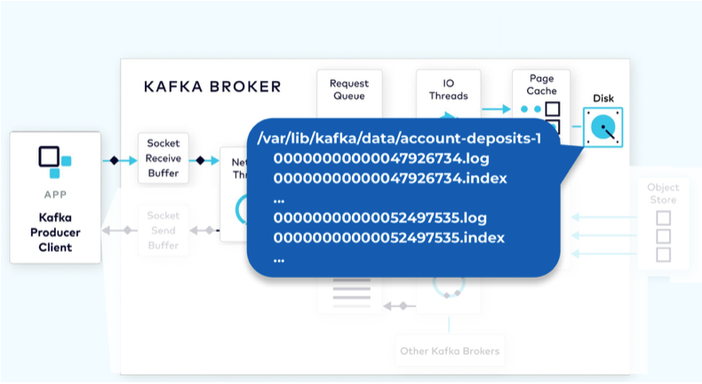
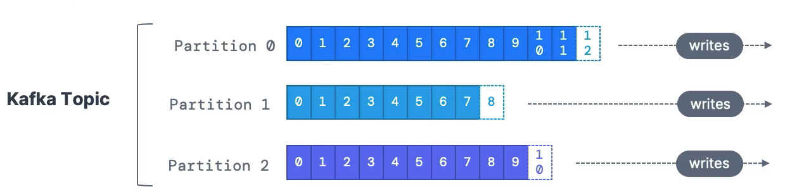
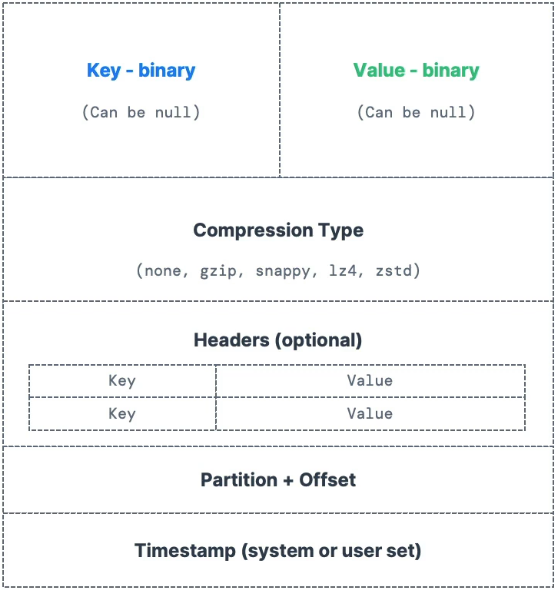
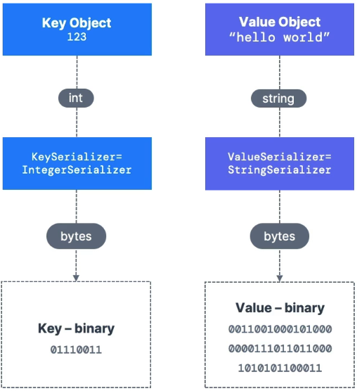
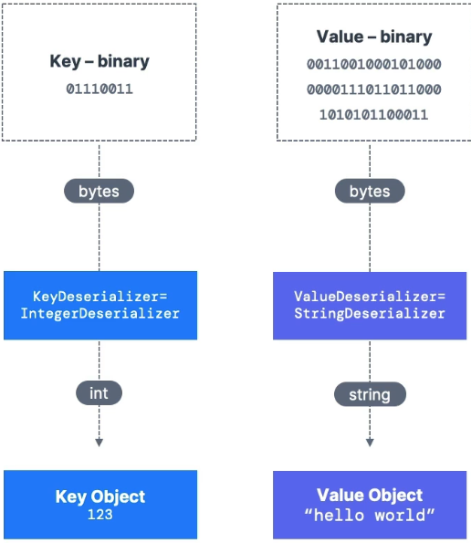
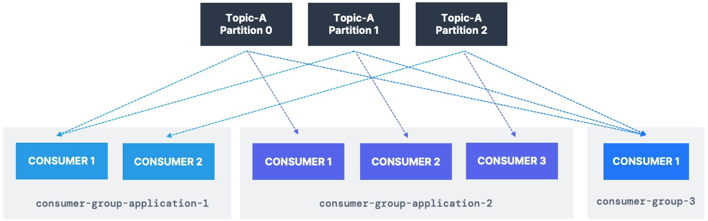
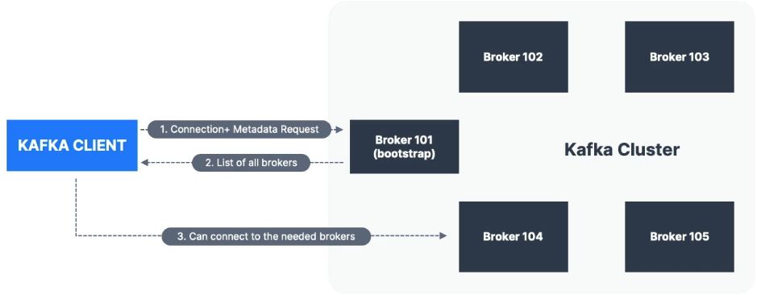
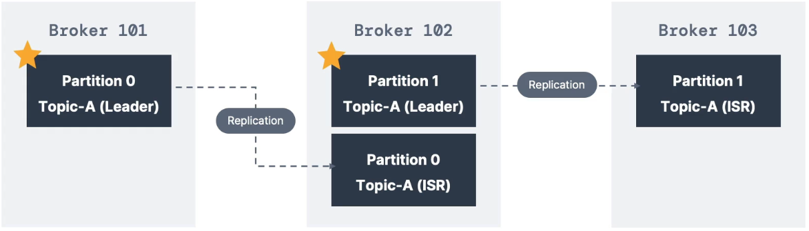
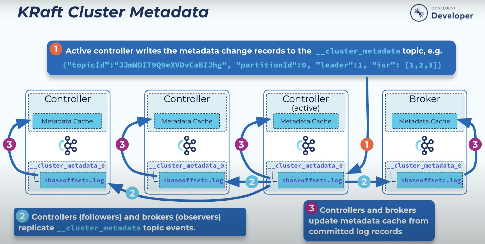

# __:material-apache-kafka: Kafka__

Apache Kafka is an open-source distributed event streaming platform designed to handle real-time data feeds at scale. Helps decouple source system from target system, allowing asynchronous processing of events. 

__Pros:__

- Horizontally scalable to 100s of brokers
- Can scale to millions of messages per second
- High performance(latency of <10ms) - real time

__Use Cases:__

- Messaging system
- Activity tracking
- Gather metrics from many different locations
- Application logs gathering
- Stream processing
- De-coupling of sytem dependencies
- Integeration with Spark, Flink, Storm, Hadoop, other Big Data technologies
- Micro-services pub/sub

__Kafka Architecture:__

Kafka archetecture is divided into 2 main components based on functionalities:

- Data Plane: Where data actually resides.
    - ___Key components: brokers, topics, replicas, partitions, producers and consumers.___
- Control Plane: Handles serveral functionalities:
    - Metadata management: Tracks information about topics, partitions, replicas, brokers, and leadership.
    - Cluster management / Controller Role: Coordinates leader elections and replica assignments, broker registrations and de-registrations.
    - Administrative operations: Topic creation, deletion, and configuration updates. Managing access control lists (ACLs) for security.
    - Security and Authentication: Manages SASL, SSL, and ACL configurations.
    - ___Key components: Controller Broker along with Zookeper(legacy setups) / Kraft controller(modern setups).___

## Data Plane

### Topics

A particular stream of data. Analogous to a table in a database, without all the contraints.

- A topic is identified by it's name.
- Supports all kinds of message format.
- The sequence of messages is called a data stream.
- Can't query topics. Data is inserted my Kafka producers and read by Kafka consumers.

<figure markdown="span">
    { width="50%" }
</figure>

### Partitions and offsets

Topics are split into partitions. Messages to a topic is distributed among partitions. ==Messages within a partition are ordered==. Each message within a partition gets an monotonically incremental id, called ==offset==.

!!! warning

    - Kafka topics are immutable: once data is written to a partition, it can't be changed
    - Data is kept only for a limited time(default 1 week - configurable)
    - Offset are unique for a given topic and partition, and not acrros topic partitions.
    - Offsets are not re-used even if previous messages have been deleted
    - Order of messages are guaranteed only within a partition(not across partitions)
    - Data is assigned randomly to a partition unless a key is provided
    - You can have as many partition per topic as required

??? info "Kafka Physical Storage"

    The messages are appended to physical data structure of the partition called a commit log. Commit log is organized as a collection of segments. Each segment is made up of several files, One of these, a `.log` file, contains the event data. A second, a `.index` file, contains an index structure, which maps record offset to the position of that record in the `.log` file.

    <figure markdown="span">
        
    </figure>

<figure markdown="span">
    
</figure>

### Message/Record

A message consistes of a key, value, headers, timestamp, partition, offset, etc...

- Kafka only accepts bytes as input from producers and sends bytes as output to consumers.
- Kafka partitioner, a code logic determines the partition for a record/message

<figure markdown="span">
    { width="50%" }
</figure>

!!! warning

    - Serialization / Deserialization type must not change during a topic's lifecycle

### Producers

- Producers write data to a specific partition of given topic.
- Producers know wich partition to write to, and which Kafka broker has it
- Producers will automatically recover, In case of Kafka broker failures
- Producer can choose to send a key with the message(string, number, binary, null etc...)
    - If `key==null`, data is sent round robing to partitions
    - Else, all messages with that key will always go to the same partition(hashing). Keys are passed, if you need message ordering for a specfic field(ex: truck_id)
- Serialization: transforms objects/data into bytes. They are used on key and Value. Producers serialize the message before sending them. Producers come with common serializers(String, float, int, etc...)

??? info "Record Batching"

    Sending records one at a time would be inefficient due to the overhead of repeated network requests. So, the producer batch records for a given partition. Batching also provides for much more effective compression, when compression is used. This can configured by setting `batch.size` and `linger.ms`

<figure markdown="span">
    { width="50%" }
</figure>

### Consumers

- Consumer read data from a topic - pull model
- Consumers automatically know which broker to read from
- Consumers will automatically recover, In case of Kafka broker failures
- Data is read in order from low to high offset ==within each partition==
- Deserialization: transforms bytes into objects/data. They are used on key and Value. Consimers deserialize the data received. Consumers come with common deserializers(String, float, int, etc...)

<figure markdown="span">
    { width="50%" }
</figure>

### Consumer groups

- All consumers in an application read data as a consumer group
- Each consumer within a group reads from exclusive partitions
- if you have more consumers than partitions, some consumers will be inactive
- You can have multiple consumer groups consuming from the same topic
- To create distict consumer groups, use the consumer property group.id

<figure markdown="span">
    
</figure>

#### Consumer group Offsets

- ==Kafka stores the offsets at which a consumer group has been reading==
- The offsets are commited to a Kafka topic named `__consumer_offsets`
- `__consumer_offsets` can have multiple partitions which impacts how consumer offset commits are distributed and processed across the cluster.
- Each partition in the `__consumer_offsets` topic can handle offset commits from multiple consumer groups.
- ___Automatic commit:___ commits offsets at regular intervals without explicit user intervention. configured by `enable.auto.commit` and `auto.commit.interval.ms` parameters
- ___Manuall commit:___ Offers 3 delivery semantics
    - `At least once`: Offsets are committed after the message is processed. If processing goes wrong, the message will be read again. Make sure processing is ==idempotent==
    - `At most once`: Offsets are committed as soon as the message is received. If processing goes wrong, Some messages will be lost
    - `Exactly once`:
        - For Kafka to Kafka worflows. i.e We read from a topic and write back to a topic as a result: use transactional API
        - For Kafka to External System workflows: use an idempotent consumer

### Brokers and Topics

- Kafka cluster is an ==ensemble== of brookers(servers)
- Each brooker is identified with it's ID(integer)
- Partitions of a given topic is distributed across brokers
- Each broker is called a bootstrap broker
- After connecting to any brooker(called a bootstrap broker), you will be connected to the entire cluster
- Each broker knows about all brokers, topics, and partitions(metadata)

<figure markdown="span">
    
</figure>

<figure markdown="span">
    
</figure>

### Topic Replication

- Topics should have a replication factor > 1
- Each partition has ==one leader== and ==multiple folowers==
- ___ISR(in-sync replicas):___ data that captures all replicas fully caught up with the leader.
- At any time only ONE broker can be a leader for a given partition
- ==Producer can only write to the leader broker for a partition==
- Consumer by default read from the leader brooker of a partition. Although possible to configure to read from the closest replica
- replication factor should be less than or equal to number of brokers. If not topic creation fails

<figure markdown="span">
    
</figure>

### Producer Acknowledgments & Topic Durability

Three options to receive acknowledgment of data writes:

- `acks=0`: Producer won't wait for acknowledgment(possible data loss)
- `acks=1`: Producer will wait for ==leader== acknowledgment(limited data loss)
- `acks=all`: ==leader +  replicas== acknowledgment(no data loss)

## Control Plane

### ZooKeeper(legacy)

A dedicate broker called the Controller broker is responsible for managing and changing the metadata of the whole cluster. The metadata is persisted in consensus service like Zookeeper/Kraft. Controller broker is also responsible for proopagating the metadata changes to other brokers.

- Contains Kafka cluster metadata
- Helps in performing leader election for partitions
- By design operates with an odd number fo servers, to attain majority quorum
- Has a leader(writes), the rest of the servers are followers(reads)
- ==Producers and consumers connect to ZooKeeper. In newer versions they connect to brookers directly==
- ==Maintains the mapping of replicas to Broker and topic configurations. Thus losing Zookeeper would render Kafka no longer functinoal with potential data loss==
- Requires a seperate security system from that used for Kafka. Thus making the setup complicated

<figure markdown="span">
    
</figure>

### KRaft

A subset of brokers are designated as controllers, and these controllers provide the consensus services that used to be provided by ZooKeeper. One controller is active and the rest are followers.

- Single security model for the whole system
- Kraft based controller can be configured using `process.roles` params in 2 ways:
    - non-overlapping nodes: some nodes dedicated as brokers, while the rest is assigned as controllers. ex: `process.roles=controller` or `process.roles=broker`
    - Shared nodes: some nodes can behave as both controller and broker. ex: `process.roles=controller, broker`
- Brokers serving as controllers is listed by `controller.quorum.voters`
- Each controller maintains an in-memory metadata cache.
- Cluster metadata is now stored in Kafka topics and managed internally.
    - A single partition Kafka topic called `__cluster_metadata`.
    - Active controller is the leader of this internal metadata topic’s single partition.
    - Other controllers are replica followers.
    - Brokers are replica observers.

<figure markdown="span">
    
</figure>

<figure markdown="span">
    
</figure>
