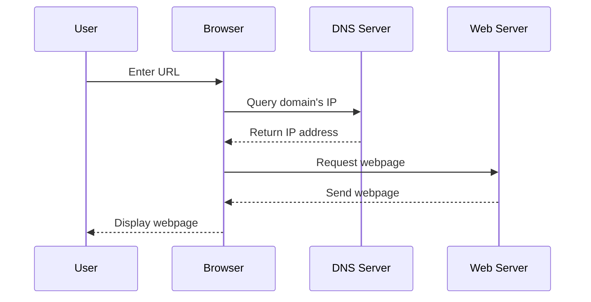
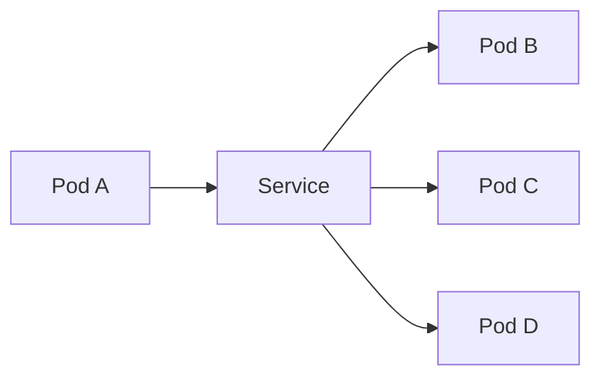

# Domain Name System (DNS)

The Domain Name System (DNS) is a hierarchical and decentralized naming system for computers, services, or other resources connected to the Internet or a private network. It associates various information with domain names assigned to each of the participating entities.

## How DNS Works

Here's a simplified explanation of how DNS works:

1. When you type a URL into your browser, your browser first needs to find out the IP address of the server hosting that URL.
2. To do this, it sends a query to a DNS server.
3. The DNS server looks up the domain name in its records and returns the corresponding IP address.
4. Your browser then sends a request to that IP address to retrieve the webpage.

## DNS Records
DNS uses several types of records to perform its functions:

- **A Records**: These records map domain names to IP addresses.
- **CNAME Records**: These records map one domain name to another.
- **MX Records**: These records specify the mail servers used for a domain.
- **NS Records**: These records specify the authoritative DNS servers for a domain.
- **PTR Records**: These records provide the reverse mapping from IP addresses to domain names.
- **SOA Records**: These records provide information about a DNS zone, such as the primary name server and the email of the domain administrator.

## DNS in Kubernetes
In a Kubernetes cluster, DNS is used to provide a way for applications to easily discover and communicate with each other. Kubernetes has an internal DNS service that automatically assigns DNS names to other services within the same Kubernetes cluster.

In this diagram, Pod A can communicate with Pods B, C, and D by sending a request to the Service. The Service acts as a load balancer and forwards the request to one of the Pods. The DNS name of the Service is automatically resolved to its internal IP address in the Kubernetes cluster.