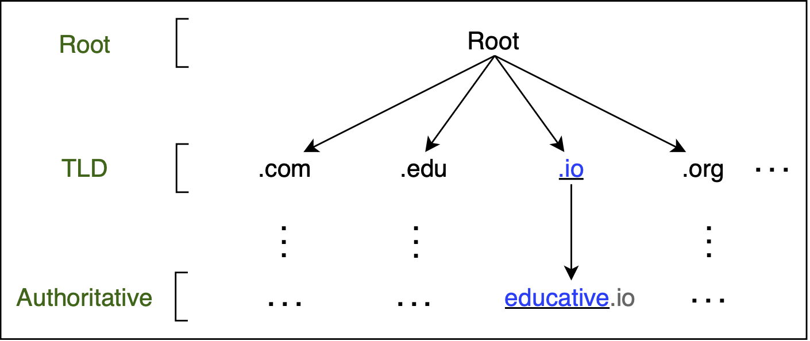
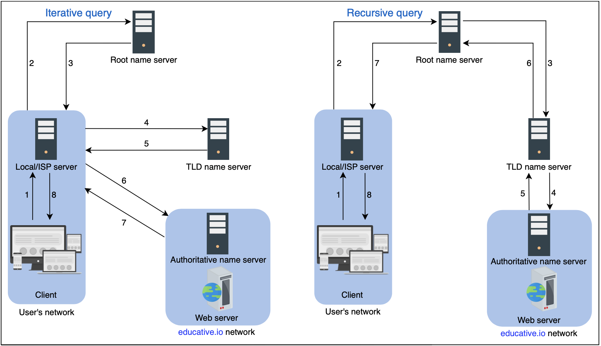
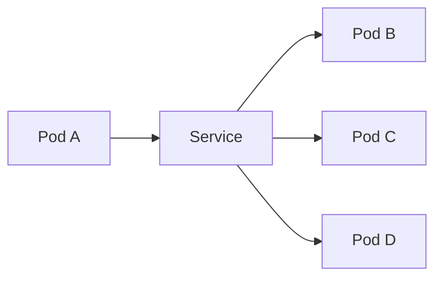

# __:material-dns-outline: DNS__

DNS is a complete infrastructure with ==name servers== at different hierarchies. It associates various information with domain names assigned to each of the participating entities.

<figure markdown="span">
    { width="600" }
</figure>

## How DNS Works

- There are mainly four types of servers in the DNS hierarchy:
    - __DNS resolver__: Resolvers initiate the querying sequence and forward requests to the other DNS name servers. Typically, lies in user’s network. Also, called local or default servers.
    - __Root-level name servers__: These servers receive requests from local servers. Root name servers maintain name servers for top-level domain names, such as `.com`, `.edu`, `.us`, and so on.
    - __Top-level domain (TLD) name servers__: These servers hold the IP addresses of authoritative name servers. Returns a list of IP addresses that belong to the authoritative servers of the organization.
    - __Authoritative name servers__: These are the organization’s DNS name servers that provide the IP addresses of the web or application servers.

- There are two ways to perform a DNS query:
    1. __Iterative__: The local server requests the root, TLD, and the authoritative servers for the IP address.
    2. __Recursive__: The end user requests the local server. The local server further requests the root DNS name servers. The root name servers forward the requests to other name servers.

<figure markdown="span">
    { width="600" }
</figure>

### TTL

- DNS compromises on strong consistency to achieve high performance because data is read frequently from DNS databases as compared to writing.
- However, DNS provides eventual consistency and updates records on replicated servers lazily.
- Consistency can suffer because of caching.
- To mitigate this issue, each cached record comes with an expiration time called time-to-live (TTL).

## DNS Records

DNS uses several types of records to perform its functions:

| Record | Purpose | Example |
| --- | --- | --- |
| __A__ | Maps domain to __IPv4 address__ | `example.com → 93.184.216.34` |
| __AAAA__ | Maps domain to __IPv6 address__ | `example.com → 2606:2800:220:1:248:1893:25c8:1946` |
| __CNAME__ | Alias: points one domain to another domain | `www.example.com → example.com` |
| __MX__ | Mail exchange server for a domain | `example.com → mail.example.com (priority 10)` |
| __TXT__ | Arbitrary text data (used for SPF, DKIM, verification) | `v=spf1 include:_spf.google.com ~all` |
| __NS__ | Lists authoritative __name servers__ for the domain | `example.com → ns1.provider.com` |
| __PTR__ | Reverse DNS: maps IP address → domain (used for validation) | `93.184.216.34 → example.com` |
| __SOA__ | Start of Authority: DNS zone settings | Contains admin email, serial, refresh times |
| __SRV__ | Used for locating services (e.g., SIP, XMPP) | `_sip._tcp.example.com → sipserver.example.com` |
| __CAA__ | Specifies which CAs can issue SSL certs | `example.com → 0 issue "letsencrypt.org"` |

## DNS in Kubernetes
In a Kubernetes cluster, DNS is used to provide a way for applications to easily discover and communicate with each other. Kubernetes has an internal DNS service that automatically assigns DNS names to other services within the same Kubernetes cluster.

In this diagram, Pod A can communicate with Pods B, C, and D by sending a request to the Service. The Service acts as a load balancer and forwards the request to one of the Pods. The DNS name of the Service is automatically resolved to its internal IP address in the Kubernetes cluster.