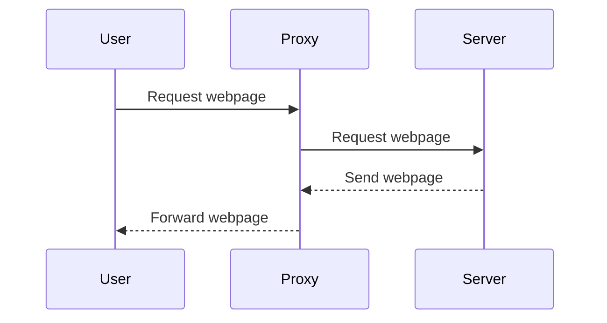
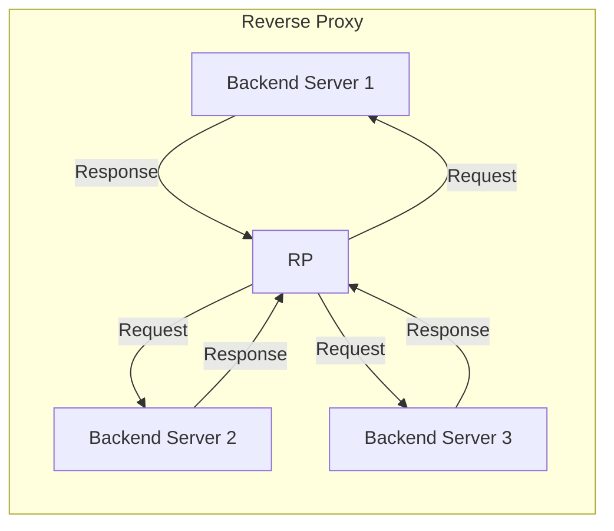
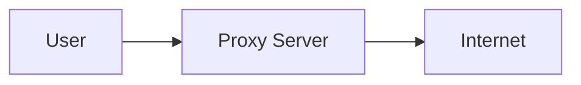

# Proxy Servers
A proxy server is a server that acts as an intermediary for requests from clients seeking resources from other servers. It allows you to go online under a different IP address identity.


## How Proxy Servers Work
When you send a request to a proxy server, the proxy makes the request on your behalf, collects the response from the server, and forwards you the collected response so you can see the webpage.




# Types of Proxy Servers
There are several types of proxy servers, each of which has a specific use case:

- **Forward Proxies** are used to prevent direct contact between a requester and an internet resource. This can be used for privacy or security reasons.

    ```mermaid
    graph LR
        subgraph Forward Proxy
            A1[Client 1] -->|Request| FP[Forward Proxy]
            A2[Client 2] -->|Request| FP
            A3[Client 3] -->|Request| FP
            FP -->|Response| A1
            FP -->|Response| A2
            FP -->|Response| A3
        end
    ```

- **Reverse Proxies** are used to provide a unified interface and cache for a clustered server-side infrastructure.




- **Open Proxies** are available to any internet user and are often used to anonymize web browsing.


## Proxy Servers in Networking
In a networking context, proxy servers can be used to provide a gateway between users and the internet. They can provide various functionalities, such as content filtering, IP masking, and load balancing.



## Proxy Servers in Kubernetes
In a Kubernetes context, the kube-proxy is a key component that maintains network rules on nodes. These network rules allow network communication to your Pods from network sessions inside or outside of your cluster.


In this diagram, Pod A can communicate with Pod B by sending a request to the kube-proxy. The kube-proxy then forwards the request to Pod B.