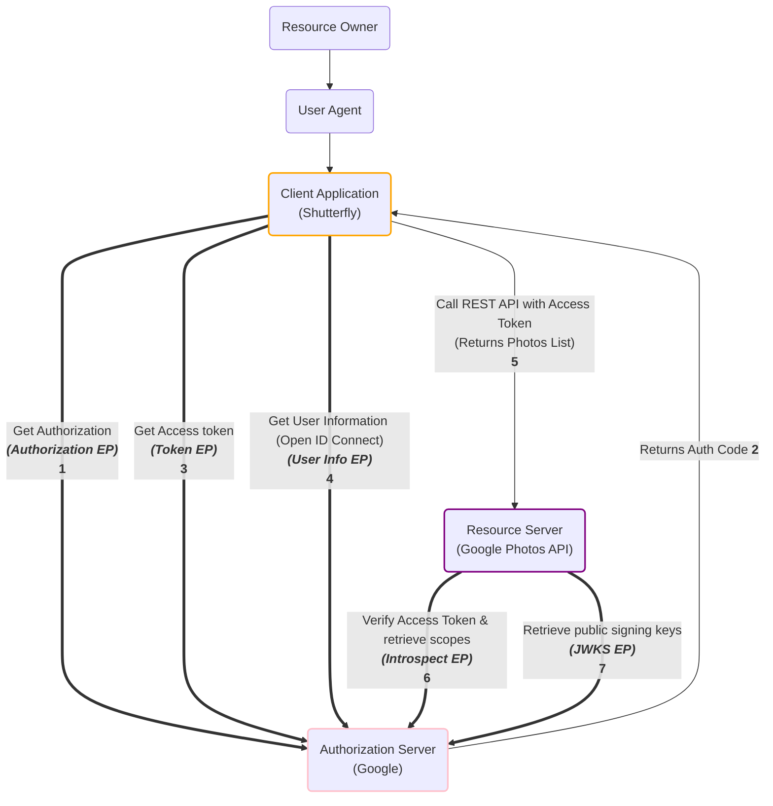

# __:simple-auth0:{.lg .top} OAuth 2.0__


## Channel Types

In the context of OAuth 2.0 and OpenID Connect, the terms "front channel" and "back channel" refer to the communication paths between the client (the application requesting access) and the authorization server (the server granting access).

__Front Channel__: This is the less secure channel. It involves the user's browser and can be susceptible to interception or manipulation by attackers. The front channel is used in steps where the user is redirected to the authorization server for authentication and then redirected back to the client with the authorization code. Because of its less secure nature, sensitive data like access tokens should not be sent over the front channel.

__Back Channel__: This is the more secure channel. It involves direct communication between the client and the authorization server, without going through the user's browser. The back channel is used when the client exchanges the authorization code for an access token. Because this communication doesn't involve the user's browser, it's less susceptible to interception or manipulation, so it's safe to send sensitive data over the back channel.


## Client Types

__Public Clients__: These are clients that cannot securely store a client secret. Examples include applications that run in a browser using JavaScript or mobile apps. Since these clients can't keep a secret safe, they are considered less secure. They can't use certain grant types like client credentials grant, and when using other grant types, additional measures (like PKCE for authorization code grant) may be needed to ensure security.

__Confidential (Private) Clients__: These are clients that can securely store a client secret. Examples include web server applications, where the secret can be securely stored on the server and not exposed to users or attackers. These clients are considered more secure and can use all grant types, including those that require a client secret.


## Grant Types

OAuth 2.0 defines several grant types, each of which is suitable for different use cases. A grant type in OAuth is the way an application gets an access token, which represents the user's permission for the client to access their data. Here are the main grant types:

=== "__Authorization Code__"

    This grant type is used for confidential clients.

    ```mermaid
    sequenceDiagram
        actor User
        box Green Back Channel
        participant Client
        participant AuthorizationServer
        participant ResourceServer
        end

        User->>Client: Request resource
        Client->>User: Redirect to Authorization Server
        User->>AuthorizationServer: Authenticate and authorize app
        AuthorizationServer->>User: Redirect back with authorization code
        User->>Client: Provide authorization code
        Client->>AuthorizationServer: Exchange code for access token
        AuthorizationServer->>Client: Provide access token
        Client->>ResourceServer: Request resource with access token
        ResourceServer-->>AuthorizationServer: Verify access token
        AuthorizationServer-->>ResourceServer: Verification result
        ResourceServer->>Client: Provide requested resource
    ```

    This diagram shows the following steps:

    1. The user requests a resource from the client.
    2. The client redirects the user to the authorization server.
    3. The user authenticates with the authorization server and authorizes the client application.
    4. The authorization server redirects the user back to the client with an authorization code.
    5. The user provides the authorization code to the client.
    6. The client exchanges the authorization code for an access token with the authorization server.
    7. The authorization server provides the access token to the client.
    8. The client requests the resource from the resource server with the access token.
    9. The resource server provides the requested resource to the client. 

    !!! note

        In addition to authorization code the client also provides client ID, client secret, __grant type__ in exchange for access token

    !!! success "pros"

        It's __secure__, as access token exchange takes place over back channel

=== "__Authorization Code (PKCE - Proof Key of Code Exchange)__"

    This grant type is used for public clients.

    ```mermaid
    sequenceDiagram
        actor User
        box Red Front Channel
        participant Client
        end
        box Green Back Channel
        participant AuthorizationServer
        participant ResourceServer
        end

        Client->>Client: Generate code_verifier and code_challenge
        User->>Client: Request resource
        Client->>User: Redirect to Authorization Server with code_challenge
        User->>AuthorizationServer: Authenticate and authorize app
        AuthorizationServer->>User: Redirect back with authorization code
        User->>Client: Provide authorization code
        Client->>AuthorizationServer: Exchange code and code_verifier for access token
        AuthorizationServer->>Client: Verify code_verifier, provide access token
        Client->>ResourceServer: Request resource with access token
        ResourceServer-->>AuthorizationServer: Verify access token
        AuthorizationServer-->>ResourceServer: Verification result
        ResourceServer->>Client: Provide requested resource
    ```

    This diagram shows the following steps:

    1. The client generates a `code_verifier` and a `code_challenge`.
    2. The user requests a resource from the client.
    3. The client redirects the user to the authorization server with the `code_challenge`.
    4. The user authenticates with the authorization server and authorizes the client application.
    5. The authorization server redirects the user back to the client with an authorization code.
    6. The user provides the authorization code to the client.
    7. The client exchanges the authorization code and `code_verifier` for an access token with the authorization server.
    8. The authorization server verifies the `code_verifier`, then provides the access token to the client.
    9. The client requests the resource from the resource server with the access token.
    10. The resource server provides the requested resource to the client.

=== "__Client Credentials__"

    ```mermaid
    sequenceDiagram
        box Green Back Channel
        participant Client
        participant AuthorizationServer
        participant ResourceServer
        end

        Client->>AuthorizationServer: Request access token with client credentials
        AuthorizationServer->>Client: Verify client credentials, provide access token
        Client->>ResourceServer: Request resource with access token
        ResourceServer-->>AuthorizationServer: Verify access token
        AuthorizationServer-->>ResourceServer: Verification result
        ResourceServer->>Client: Provide requested resource
    ```

    This diagram shows the following steps:

    1. The client requests an access token from the authorization server using its client credentials. This happens over the back channel.
    2. The authorization server verifies the client credentials and provides an access token. This happens over the back channel.
    3. The client requests the resource from the resource server with the access token. This happens over the back channel.
    4. The resource server provides the requested resource to the client. This happens over the back channel.


    !!! note

        - It's secure, as token exchange takes place over back channel
        - ex: cron jobs, automations, etc...

=== "__Refresh Token__"

    This is used in conjunction with other grant types

    ```mermaid
    sequenceDiagram
        box Green Back Channel
        participant Client
        participant AuthorizationServer
        participant ResourceServer
        end

        Client->>AuthorizationServer: Request new access token with refresh token
        AuthorizationServer->>Client: Verify refresh token, provide new access token
        Client->>ResourceServer: Request resource with new access token
        ResourceServer-->>AuthorizationServer: Verify access token
        AuthorizationServer-->>ResourceServer: Verification result
        ResourceServer->>Client: Provide requested resource
    ```

    This diagram shows the following steps:

    1. The client requests a new access token from the authorization server using the refresh token. This happens over the back channel.
    2. The authorization server verifies the refresh token and provides a new access token. This happens over the back channel.
    3. The client requests the resource from the resource server with the new access token. This happens over the back channel.
    4. The resource server provides the requested resource to the client. This happens over the back channel.

=== "__:material-alert-octagon:{ .lg .middle } Implicit (Deprecated)__"

    This grant type is used for public clients.

    ```mermaid
    sequenceDiagram
        actor User
        box Red Front Channel
        participant Client
        end
        box Green Back Channel
        participant AuthorizationServer
        participant ResourceServer
        end

        User->>Client: Request resource
        Client->>User: Redirect to Authorization Server
        User->>AuthorizationServer: Authenticate and authorize app
        AuthorizationServer->>User: Redirect back with access token
        User->>Client: Provide access token
        Client->>ResourceServer: Request resource with access token
        ResourceServer-->>AuthorizationServer: Verify access token
        AuthorizationServer-->>ResourceServer: Verification result
        ResourceServer->>Client: Provide requested resource
    ```

    !!! failure "cons"

        Not secure, as the access token exchanged over front channel

=== "__:material-alert-octagon:{ .lg .middle } Resource Owner Password Credentials (Deprecated)__"

    ```mermaid
    sequenceDiagram
        actor User
        box Green Back Channel
        participant Client
        participant AuthorizationServer
        participant ResourceServer
        end

        User->>Client: Provide username and password
        Client->>AuthorizationServer: Request access token with username and password
        AuthorizationServer->>Client: Verify credentials, provide access token
        Client->>ResourceServer: Request resource with access token
        ResourceServer-->>AuthorizationServer: Verify access token
        AuthorizationServer-->>ResourceServer: Verification result
        ResourceServer->>Client: Provide requested resource
    ```

    !!! note

        - User credentials are passed to the client and not authorization server
        - Should only be used if the client is a 1st party application(i.e maintained by owners of authorization server) / Trusted application

!!! warning
    __Token Revocation__: each grant type should provide an option to invalidate an already issued access or refresh token. This is especially necessary in case of referesh tokens as they have a long life span


## Endpoints



- __Authorization Endpoint (Authorization EP)__: This is where the application (client) sends the user to log in and authorize the application. The user is authenticated by the authorization server and then asked if they want to grant the application the requested permissions (scopes). If the user grants the permissions, they are redirected back to the application with an authorization code.

- __Token Endpoint (Token EP)__: After the application receives the authorization code, it sends a request to the token endpoint to exchange the authorization code for an access token. This request also includes the client's credentials for authentication.

- __User Info Endpoint (User Info EP)__: This endpoint returns claims about the authenticated user. The application can send a request to this endpoint with the access token to get information about the user, such as their username, email, and other data that was granted by the user.

- __Introspection Endpoint (Introspect EP)__: This endpoint is used to get information about an access token. The application can send a request to this endpoint with the access token, and the endpoint will return a response indicating whether the token is active or not, along with other information about the token such as its scopes and expiration time.

- __JSON Web Key Set Endpoint (JWKS EP)__: This endpoint exposes the public keys used by the authorization server to sign the tokens. The application can use these keys to verify the signature of the tokens it receives.


## OpenID Connect

OpenID is an open standard and decentralized authentication protocol. It allows users to be authenticated by certain co-operating sites (known as Relying Parties or RP) using a third-party service. This eliminates the need for webmasters to provide their own ad hoc login systems, and allows users to log in to multiple unrelated websites without having to have a separate identity and password for each.

Users create accounts by selecting an OpenID identity provider, and then use those accounts to sign onto any website which accepts OpenID authentication. The OpenID standard provides a framework for the communication that must take place between the identity provider and the relying party (RP).

OpenID Connect (OIDC) is a simple identity layer on top of the OAuth 2.0 protocol, which allows computing clients to verify the identity of an end-user based on the authentication performed by an authorization server, as well as to obtain basic profile information about the end-user in an interoperable and REST-like manner.

Client can access user information through ID Token or user information endpoint by passing relavent scopes. Autorization server returns an ID token in addition to access token if openID scopes are includeed in the request.

These are scopes specific to OpenID and are used to retrive user information. here is a list of OpenID scopes:

- openid: core user information
- profile
- email: email, verified
- address
- phone