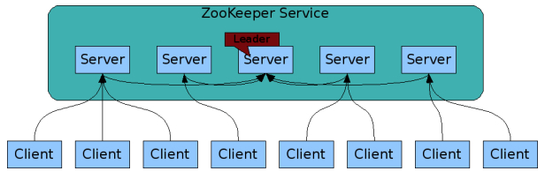
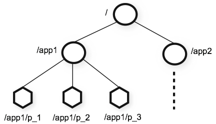

# __ZooKeeper__

ZooKeeper is a distributed, open-source coordination service for distributed applications. It exposes a simple set of primitives that distributed applications can build upon to implement higher level services for synchronization, configuration maintenance, and groups and naming.

ZooKeeper allows distributed processes to coordinate with each other through a shared hierarchical namespace which is organized similarly to a standard file system. Unlike a typical file system, which is designed for storage, ZooKeeper data is kept in-memory, which means ZooKeeper can achieve high throughput and low latency numbers. 

<!-- The ZooKeeper implementation puts a premium on high performance, highly available, strictly ordered access. The performance aspects of ZooKeeper means it can be used in large, distributed systems. The reliability aspects keep it from being a single point of failure. The strict ordering means that sophisticated synchronization primitives can be implemented at the client(distributed application). -->

ZooKeeper is replicated. Like the distributed processes it coordinates, ZooKeeper itself is intended to be replicated over a set of hosts called an  ==ensemble==.

<figure markdown="span">
    
</figure>

??? info "Guarantees"

    - Sequential Consistency - Updates from a client will be applied in the order that they were sent.
    - Atomicity - Updates either succeed or fail. No partial results.
    - Single System Image - A client will see the same view of the service regardless of the server that it connects to. i.e., a client will never see an older view of the system even if the client fails over to a different server with the same session.
    - Reliability - Once an update has been applied, it will persist from that time forward until a client overwrites the update.
    - Timeliness - The clients view of the system is guaranteed to be up-to-date within a certain time bound.

??? note "API"

    One of the design goals of ZooKeeper is providing a very simple programming interface. As a result, it supports only these operations:

    - create : creates a node at a location in the tree
    - delete : deletes a node
    - exists : tests if a node exists at a location
    - get data : reads the data from a node
    - set data : writes data to a node
    - get children : retrieves a list of children of a node
    - sync : waits for data to be propagated


## Data model and the hierarchical namespace

The namespace provided by ZooKeeper is much like that of a standard file system. A name is a sequence of path elements separated by a slash (/). Every node in ZooKeeper's namespace is identified by a path.

Unlike standard file systems, each node in a ZooKeeper namespace can have data associated with it as well as children. It is like having a file-system that allows a file to also be a directory. (ZooKeeper was designed to store coordination data: status information, configuration, location information, etc., so the data stored at each node is usually small, in the byte to kilobyte range.) We use the term ==znode== to make it clear that we are talking about ZooKeeper data nodes.

<figure markdown="span">
    
</figure>


??? info "Use cases"

    - Service Discovery: Helps distributed apps discover services by maintaining dynamic list of availbale service and metadata. Services register themselves and clients query zookeeper to find the appropriate service endpoints
    - Distributed Configuration Management: Storez and manages configuration files for distributed systems in a centralized, reliable way. Apps fetch data from zookeeper, and changes are dynamically propagated to all clients.
    - Leader Election: Ensures a single leader is elected in a cluster to avoid conflicts or duplicate processing. Nodes create an ephemeral znode in Zookeeper, and the node with the smallest sequence number becomes the leader.
    - Distributed Locking: Provides distributed locking to prevent race conditions in shared resources across a distributed system. Clients create znodes to acquire a lock. If the znode already exists, other clients wait for it to be deleted, indicating the lock is released.


## Configuration

The ZooKeeper configuration properties file is located in `/etc/kafka/zookeeper.properties`.

??? note "`clientPort`"

    This is the port where ZooKeeper clients will listen on. ex: Kafka Brokers will connect to this. default 2181

??? note "`admin.enableServer`"

    Set to "false" to disable the AdminServer. By default the AdminServer is enabled.

??? note "`admin.serverPort`"

    To configure admin server. The port the embedded Jetty server listens on. Defaults to 8080.

??? note "`dataDir`"
    
    The location to store the in-memory database snapshots and, unless specified in `dataLogDir`, the transaction log of updates to the database.

??? note "`dataLogDir`"
    
    This option will direct the machine to write the transaction log to the dataLogDir rather than the `dataDir`. This allows a dedicated log device to be used, and helps avoid competition between logging and snapshots

??? note "`tcpKeepAlive`"

    Setting this property to true enables connections between quorum members to remain up when there is network infrastructure that may cause the connections to be broken. Some NATs and firewalls may terminate or lose state for long-running or idle connections. Enabling this option relies on OS level settings to work properly, so check your operating system’s options for TCP `keepalive`. Setting `tcpKeepAlive` to true can help mitigate scenarios that cause ZooKeeper leader elections to take a long time.

??? note "`tickTime`"

    The unit of time for ZooKeeper translated to milliseconds. This governs all ZooKeeper time dependent operations. It is used for heartbeats and timeouts especially. Note that the minimum session timeout will be two ticks.

??? note "`initLimit`"

    Is the timeout ZooKeeper uses to limit the length of time the ZooKeeper servers in quorum have to connect to a leader. expressed as number of ticks

??? note "`syncLimit`"

    Limits how far out of date a server can be from a leader.

??? note "`maxClientCnxns`"

    The maximum allowed number of client connections for a ZooKeeper server. To avoid running out of allowed connections set this to 0 (unlimited).

??? note "`autopurge.snapRetainCount`"

    When enabled, Zookeeper retains the corresponding number of most recent snapshots, and transaction logs in the dataDir and dataLogDir respectively and deletes the rest.

??? note "`autopurge.purgeInterval`"

    The time interval in hours for which the purge task has to be triggered. Set to a positive integer (1 and above) to enable the auto purging.

??? note "`server.X`"

    ```{.markdown}
    server.1=zoo1:2888:3888
    server.2=zoo2:2888:3888
    server.3=zoo3:2888:3888
    ```

    List the servers that make up the ZooKeeper service. When the server starts up, it knows which server it is by looking for the file myid in the data directory.

    ==Note the two port numbers after each server name: "2888" and "3888"==.
    
    - ==Quorum Port(2888)==: Peers use this port to connect to communicate with their ensemble peers, for example, to agree upon the order of updates. More specifically, a ZooKeeper server uses this port to connect followers to the leader. When a new leader arises, a follower opens a TCP connection to the leader using this port. 
    - ==Leader Election Port(3888)==: Because the default leader election also uses TCP, we currently require another port for leader election.


## Monitoring

ZooKeeper provides a number of JMX metrics.

??? info "JMX (Java Management Extensions)"
    __JMX (Java Management Extensions)__ is a Java technology used for monitoring and managing applications, system objects, devices, and services. It provides a standard way to expose application-level metrics, configuration options, and operational controls.

    ### Key Features
    - __MBeans (Managed Beans)__: Encapsulate metrics, attributes, and operations for monitoring and management.
    - __JVM Metrics__: Exposes heap memory, garbage collection, thread activity, and class loading statistics.
    - __Application-Specific Metrics__: Custom metrics for business logic, database connections, and request latencies.
    - __Real-Time Monitoring__: Enables immediate access to application performance data.
    - __Interoperability__: Works with tools like JConsole, VisualVM, and Prometheus JMX Exporter.
    - __Remote Management__: Access metrics and control operations via RMI or other connectors.

    JMX is widely used in Java-based systems like ZooKeeper, Kafka, and Spring applications to provide insights into system health and facilitate debugging.

Here are a few JMX metrics that are important to monitor:

- __NumAliveConnections__: make sure you are not close to maximum as set with maxClientCnxns
- __OutstandingRequests__: should be below 10 in general
- __AvgRequestLatency__: target below 10 ms
- __HeapMemoryUsage (Java built-in)__: should be relatively flat and well below max heap size

In addition to JMX metrics ZooKeeper provides other metrics to ensure the health of ZooKeeper-Kafka interactions. [details](https://docs.confluent.io/platform/current/kafka/monitoring.html#kafka-monitoring-metrics-zookeeper)

- ZooKeeperAuthFailuresPerSec (secure environments only)
- ZooKeeperDisconnectsPerSec
- ZooKeeperExpiresPerSec
- ZooKeeperReadOnlyConnectsPerSec
- ZooKeeperSaslAuthenticationsPerSec (secure environments only)
- ZooKeeperSyncConnectsPerSec
- SessionState